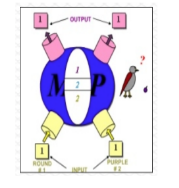

# Lecture 1: Introduction
## What is AI?
There are no crisp definitions. Here is one from __John McCarthy__, (Father of the phrase _Artificial Intelligence_)
see http://www.formal.stanford.edu/jmc/whatisai/

__Question:__ What is artificial intelligence?
__Answer:__ It is the science and engineering of making intelligent machines, especially intelligent computer programs. It is related to the similar task of using computers to understand human intelligence, but AI does not have to confine itself to methods that are biologically observable.

__Question:__ Yes, but what is intelligence?
__Answer:__ Intelligence is the computational part of the ability to achieve goals in the world. Varying kinds and degrees of intelligence occur in people, many animals and some machines.

"It is the science and engineering of making intelligent machines, especially inteliigent computer programs" - __John McCarthy__

"AI is the science of making machines to do things that would require intelligence if done by men." - __Marvin Minsky__

"The study of mental faculties through the use of computational models" - __Eugen Charniak__

In short: There is no formal definition covering all aspects of intelligence.
## Two aspects of AI
__Science__
The science of understanding intelligent entities, developing theories which attempt to explain and predict the nature of such entities
Discover ideas about knowledge that help explain various sorts of intelligence
Model functions of the human brain

__Engineering__
Solving real-world problems by employing ideas of how to represent and use knowledge
Engineering of intelligent entities
Produce intelligent behaviour by any means
## Can machines be Intelligent?
* _Symbolic system hypothesis_ (Newell and Simon)
  * Intelligence is substrate neutral
  * A _physical symbol system_ has necessary and sufficient means for general intelligent action.
* Biological substrate only (John Searle, philosopher)
  * Intelligence is substrate dependent
  * The material humans are made of is fundamental for our intelligence.
  * Thinking is possible only in special machines - living ones made of proteins.
* Some researchers belive that _sub-symbolic_ processing (signal processing) may be needed to replicate intelligence.
## AI prehistory - grounding disciplines
Computer Science is the main discipline underlying AI.
Can we thing which other disciplines AI is grounded on?

## AI prehistory
* __Philosophy:__ logic, methods of reasoning, mind as physical system, foundations of learning, language, rationality
* __Mathematics:__ logic, formal representation, algorithms, computation, probability theory
* __Statistics:__ modeling uncertainty, learning from data
* __Psychology:__ phenomena of perception and motor control, cognitive psychology
* __Economics:__ formal theory of rational decisions, utility
* __Linguistics:__ knowledge representation, grammar, syntax, semantics
* __Neuroscience:__ neurons as information processing units, synapse as learning mechanism
* __Control theory:__ homeostatic systems, stability, simple optimal agent designs, maximize objective function
* __Computer science:__ engineering, hardware, computational complexity theory
## Birth of AI field
A Summer Research Project in the Dartmouth College, in 1956 was the birth of the AI research field.

McCarthy: "...to proceed on the basis of the conjecture that every aspect of learning or any other feature of intelligence can in principle be so precisely described that a machine can be made to simulate it."
## Brief history of AI
* __1943__: McCulloch & Pitts: Boolean circuit model of brain
* __1950__: Turing's "Computing Machinery and Intelligence"
* __1952-69__: Early AI programs, including Samuel's checkers program, Newell & Simon's Logic Theorist, Gelernter's Geometry Engine
* __1956__: Dartmouth meeting: "Artificial Intelligence" adopted
* __1962__: Rosenblatt's Perceptron for training simple neural networks
* __1965__: Robinson's complete algorithm for logical reasoning
* __1972__: The logic programming language PROLOG is created
* __1966-74__: Disappointment: AI discovers computational complexity. Neural network research almost disappears.
* __1969-79__: Early development of knowledge-based systems
* __1980-88__: Expert systems industry booms
* __1988-93__: Expert systems industry busts: "AI Winter"
* __1985-95__: Backpropagation learning returns neural networks to popularity.
* __1988-__: Resurgence of probability; general increase in technical depth. "Nouvelle AI": ALife, GA
* __1995-__: Agents, agents, everywhere...
* __2003-__: Human-level AI back on the agenda
* __2005-2010__: AI disappoints again, AI is not much appreciated
## Example from Early History of AI
1943 McCulloch & Pitts: Boolean circuit model of brain

## McCulloch and Pitts 1943
__Goal:__ to understand how the brain produces complex thoughts ("propositions") by using (simple) neurons
* model of a neuron, axon, dendrone - "MCP neuron"
* network of neurons
* transfer of information through on/off mechanism of neurons
* every network of MCP neurons encodes some logical proposition
## McCulloch and Pitts 1943 - "Bird example"
Example from:
http://www.mind.ilstu.edu/curriculum/mcp_neurons/mcp_neuron_1.php?modGUI=212&compGUI=1749&itemGUI=3018

Assume a bird will "decide" to eat/not an object (e.g., blue berry, orange, basketball, daisy). It receives/perceives two inputs about the object:
* shape: round or not
* colour: purple or not
* decision: eat only if round purple object (e.g., blue berry)

* two inputs (each takes value $0$ or $1$)
* threshold $T$
* output is a function of inputs and $T$
```
IF(sum(inputs)) >= T
THEN Output=1
```



## Some killer apps in AI
* __1991:__ During the Gulf War, US forces deployed an AI logistics planning and scheduling program that involved up to $50,000$ vehicles, cargo, and people. Saved the US more money than spent on all AI research since 1950.
* __1997:__ Deep Blue (IBM) beat world chess champion Gerry Kasparov"
* __2011:__ Watson (IBM) beat human champions on "Jeopardy"
* __2012:__ Google car obtains driver's license in Nevada, US. By 2014, the cvars have driven for 1.1 million km without accidents.
* __2017:__ DeepMind's AlphaGo and Elon Musk's A.I. Destroys Champion Gamer! https://www.youtube.com/watch?v=XbDmxEOj9OY
## What is AI?
Russel and Norvig's definition of AI
Two dimensions:

Types/approaches to AI - as defined by Russel and Norvig:

## Thinking humanly: Cognitive Science
1960s "__cognitive revolution__": information-processing psychology replaced prevailing orthodoxy of __behaviorism.__
Tries to form computational theories of internal activities of the brain. How to validate? Requires
1. Predicting and testing behaviour of human subjects (top-down), or
2. Direct identification of neurological data (bottom-up)

Both approaches (roughly, __Cognitive Science__ and __Cognitive Neuroscience__) are now distinct from AI.

Both share with AI the following characteristics: the available theories do not explain (or engender) anything resembling human-level general intelligence.
## John McCarthy talks about AI
https://www.youtube.com/watch?v=Ozipf13jRr4
## Acting humanly: The Turing test
Turing (1950) "Computing machinery and intelligence":
"Can machines think?" $\rightarrow$ "__Can machines behave intelligently__"
Operational test for intelligent behavior: the __Imitation Game__

## Acting Humanly - Eliza
* One of the most famous early AI programs: Eliza, the computer psychotherapist, created by Joseph Weizenbaum in 1966 at MIT.
* Eliza functions by "twisting the statements of her 'patients' back at them in the classic manner of a non-directive psychotherapist."
* The fact that it understands the subject's statements is an illusion.
* Surprisingly, many users were taking its performance quite seriously.

## How humanly is Sophia (Hong Kong firm Hanson Robotics)?
https://www.youtube.com/watch?v=suRuQbDXcrc
## Thinking rationally: Laws of Thought - 1
* Aristotle: what are correct arguments/thought processes? Formalize "correct" reasoning using a mathematical model.
* Several Greek schools developed various forms of __logic:__ _notation_ and _rules of derivation_ for thoughts.
* Direct line through mathematics and philosophy to modern AI.
## Thinking rationally: Laws of Thought - 2

## Thinking rationally: Laws of Thought - 3

## Thinking rationally: Laws of Thought - 4
Problems:
1. Not all intelligent behavior is mediated by logical deliberation
2. What is the purpose of thinking? What thoughts _should_ I have out of all the thoughts (logical or otherwise) that I _could_ have?
3. Formalizing (informal) common sense knowledge is difficult.
4. General deductive inference is computationally intractable.
## Acting rationally: Rational Agents approach
* __Rational__ behavior: doing the right thing.
* The right thing: that which is expected to maximize goal achievement, given the available information and computational abilities.
* Doesn't necessarily involve thinking - e.g., blinking reflex - but thinking should be in the service of rational action.
## Two main AI paradigms
* __Good old fashioned AI__ (GOFAI)
* __Situated embodied AI__ (SEAI)
## Good old fashioned AI
* Most of the successes if AI in the 1970s and 1980s were due to research based on Newell's and Simon's _Physical Symb'ol System Hypothesis_
* A physical symbol system has the necessary and sufficient means for general intelligent action.
* Newell and Simon viewed intelligence as _symbol manipulation,_ and hypothesized that it didn't make difference what physical medium - brain, paper, or computer - was used to do the symbol manipulation.
* Hence a special emphasis on _symbolic representations,_ which can be interpreted as reprsenting situations in the real world, e.g. "a block world"
## Critiques of GOFAI
* __Searle:__ a program (or any physical symbol system) could not be said to understand the symbols that is utses; the symbols have no meaning for the machine.
* __Brooks:__ our most basic skills of motion, survival, perception, balance etc. do not seem to require high level symbols at all; the use of high level symbols was more complicated and less successfull.
* __Harnad:__ the __symbol grounding__ problem: an agent does not perceive symbols, instead the brain converts sensory inputs into higher level abstractions, e.g. symbols.
## Emergence of SEAI
* The GOFAI approaches turned out to be brittle and very little robust when deployed on real-world problems.
* Trying to define a model of the world turned out to be quite hard - this led to Brook's statement that "the world is its own best model"
* Situated and embodied AI focuses on having a body (i.e. motor skills) in a physical environment.
* Swarm intelligence, subsymbolic AI, genetic algorithms, neural networks - however, this is not a big part of this course, this is covered in more detail in other AI courses.
