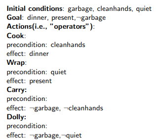

# Lecture 10 - Planning
## What is planning?
Human Planning and Acting
* Acting without (explicit) planning
  * when purpose is immediate
  * when performing well-trained behaviour
  * when course of action can be freely adopted
* Acting after planning
  * when addressing a new situation
  * when tasks are complex
  * when the environment imposes high risk/cost
  * when collaborating with others

People plan only when strictly necessary.
## Intelligent Agents: Planning, Execution, and Learning

## An early example


* Example: NASA's Deep Space 1
  * Launched in 1998 to test technologies and perform flybys of astreroid Braille and Comet Borrelly
  * First spacecraft to be controlled by an AI system without human intervention
  * Remote Agent (remote intelligent self-repair software) system used to __plan__ on-board activities and correctly diagnose and respond to simulated faults
  * Planning system was later used on the ground-based __Mars Exploration Rovers__
## Aspects of Planning
* There are various ways of defining a planning problem and several ways of doing planning
* Two main aspects of planning are
  * representation
  * reasoning mechanism
## Representation types
Chapter 2 defines 3 types of representation:
* Atomic
* Factored
* Structured


## Representational related issues
Let us revisit Chapter 7, Wumpus example.
* Using propositional logic, the agent could answer questions like "Which square I am in after making a _forward_ action", or "is the neighbour square $(2,1)$ safe to move to?".
* Remember that the KB has:
  * axioms, general domain knowledge of which truth doesn't need to be proven. They are given true.
  * Perceived current situation/observations.
* It is important to note that a percept is about only one time step.
  * For example, proposition __Stench__ now may be contradictory if $\neg$__Stench__ is already in the KB - if we don't represent time.
  * There is Stent in time step 3, i.e., __Stench__$^3$ will not contradict with $\neg$__Stench__$^2$
## The issue of time
* The time is an important aspect in Planning.
* Definition: We refer to aspects of world that changes from one time step to another as __fluents.__
* Example fluent: Location$_{xy}^t=$ Location, i.e., coordinates of the square the agent is in at time $t$ is a fluent.
* An action changes some aspect of the world (hence fluents), but not all aspects.
* The agent needs to keep track of fluents. But it also should know what remains unchanged.
## Fluents
* We say, in planning, that the __effect__ of an action makes change in the fluents.
* Example __effect axiom:__ The agent is at location/square/$[1,1]$ and facing east at time $=0$ and goes forward. The result is that the agent is in square $[2,1]$ and not any longer in $[1,1]$ at time $=1$
$$Location_{11}^0\wedge FacingEast^0\wedge Forward^0\implies Location_{21}^1\wedge\neg Location_{11}^1$$
* If we use effect axioms, we'll need explicit assertion of such sentences about all time steps, all squares, actions, etc.
* In addition, effect axioms don't represent/express what remains unchanged by an action
## The Frame Problem
* So, the agent needs to know what remains unchanged in the environment when a particular action is executed
* This we call representational __frame problem,__ i.e. how to represent fluents that don't change from one time step to another.
* A solution: The unchanged aspects of world can be represented in form of "Frame axioms" expressing all propositions that remain unchanged. E.g.,
  * $Forward^t\implies(HaveArrow^t\Leftrightarrow HaveArrow^{t+1})$
  * $Forward^t\implies(WumpusAlive^t\Leftrightarrow WumpusAlive^{t+1})$
  * ...
* Too many such axioms, hence inefficient
* One solution: Focusing on fluents $(F)$ rather than actions, and use __successor state axioms__ instead
* "Successor state axioms"
$$F^{t+1}\Leftrightarrow ActionCauses\,F^t\vee(F^t\wedge\neg ActionCausesNotF^t.)$$
* Examples on Successor state axioms:
  * $HaveArrow^{t+1}\Leftrightarrow(HaveArrow^t\wedge\neg Shoot^t)$
  * $L_{1,1}^{t+1}\Leftrightarrow(L_{1,1}^t\wedge(\neg Forward^t\vee Bump^{t+1})\vee(L_{1,2}^t\wedge(South^t\wedge Forward^t)\vee(L_{1,3}^t\wedge(West^t\wedge Forward^t))$
## Preconditions for Actions
* Representation of actions also need explicit statement of when an action is executable
* I.e., the conditions where the action can be applied, as __precondition axiom__
* Example in Propositional logic: In order to shoot an arrow, the agent must have an arrow: $Shoot^t\Leftrightarrow HaveArrow^t$
* Another issue: the interference between actions
  * For ex. Let us assume that Shoot and Forward may not be done at the same time - How to represen this in the system?
  * Explicitly state every action pair not allowed to "execute" at the same time in form of __action exclusion axioms__
  * Example action exclusion axiom: $\neg Shoot^t\vee\neg Forward^t$
* We will see different types of action (and action-related knowledge) representations in the research field of Planning - soon.
## Propositional Logic for planning
Logic can be used in 2 ways for planning:
1. Using SAT solver, i.e., using __satisfiability__
2. Combined with a search algorithm
## Use of Satisfiability for Planning
Basic idea:
1. Define and represent the problem:
    a) A collection of assertions about the initial state

    b) Successor-state axioms for all possible actions at each time step, precondition-axioms, action-exclusion axioms

    c) Assertion for the goal state. E.g., Havegold
2. Present the problem sentenses to __SAT solver.__ If it finds a satisfying model then the goal is achievable, otherwise plan is impossible.
3. Assuming a model is found, extract from the model those variables that represent actions and are assigned true.
## Logic and Search 
* The agent uses logical inference to infer whether it has an arrow (or another aspect of world) after an action.
* The agent uses search to decide which action to take.
  * The agent can use a search algorithm we saw in chapter $3,$ for example, $A^*$ to decide which action to take
* Hence, we can consider planning as a search in a search space (more about spaces later today)
## Representation in Planning Research
* As we have seen, it is possible to represent as ground sentence
  1. initial state
  2. axioms in the domain - other names are "domain knowledge", "state transition knowledge"
  3. goal state
* But representation of each ground sentence is not efficient and takes too much memory to scale up
* As a result researchers in the field defined new language tailored for planning
## Representation of Actions
* PDDL, a modified version of STRIPS language the text book uses.
* Basic idea:
  * Describe actions at an abstract level as __action schema__
  * Uses a restricted form of predicate logic

__Action:__ $PutOn(r,x,y)$
__Precondition:__ $On(r,x)\wedge Clear(r)\wedge Clear(y)$
__Effect:__ $On(r,y)\wedge Clear(x)\wedge\neg On(r,x)\wedge\neg Clear(y)$
* times and states are implicit in the action schemas: preconditions refer to time $t$ and effect to time $t+1$
* the set of action schemas define the domain of the considered planning problem
## The Frame Problem
* Should we represent the effect of __PutOn__ on the other variables? Need to enumerate explicitly all of the variables in the world.
* One solution: It is implicitly assmed that __any symbol not mentioned in effect remains unchanged.__
* Compute the result of an action $a$ taken in state $s:$
  * Think of the __effect__ of an action consisting of the positive and negative effects, i.e.,
    * __Effect:__ $On(r,y)\wedge Clear(x)\wedge\neg On(r,x)\wedge\neg Clear(y)$
  * The positives (call "ADD") are the one that will be true in the resulting state while the negative (call "DEL") ones will be removes from state $s:$
  State of $s+1$ caused by execution of action $a:$ $(s-DEL(a))\cup ADD(a).$
## Representation of States
* Each state is represented as a conjunction of fluents that are ground, functionles, and non-negative atoms.
* The following are not allowed in a state:
  * $University(x)$; $x$ is a university. Not state because of variable.
  * $\neg BestUniversity(NTNU, Norway)$; not, because of negation.
  * $InTrondheim(BestUniversity(Norway)):$ not, because of function.
## Representation of States in PDDL and Closed World Assumption
* State representation relies on __Closed World Assumption:__ any fluent not mentioned in a state is false.
* An initial state is a conjunction of ground atoms - i.e. no variable
* A goal state is a conjunction of literals (positive/negative) that may contain variables - similar to preconditions.
  E.g., $At(p, Trondheim)\wedge Politican(p)$ a/any politician is in Trondheim.
* Other languahes make different assumptions, e.g., negative literals part of state, unmentioned literals unknown.
* E.g., STRIPS does not allow negative literals in preconditions and goals.
## Design of Actions
Example: Blocks are represented by constants $A,B,C$ and an additional constant, $Table,$ is representing the table.

__Start:__ $On(A, Table)\wedge On(B, Table)\wedge On(C, A)\wedge Clear(B)\wedge Clear(C)$
__Goal:__ $On(A, B)\wedge On(B,C)$
__Action Schema:__
$Action(Move(b,x,y))$
$PRECOND: On(b,x)\wedge Clear(b)\wedge Clear(y)$
$EFFECT: On(b,y)\wedge Clear(x)\wedge\neg On(b,x)\wedge\neg Clear(y)$

However, there are some problems here. Which?

__Prolem:__ When $x$ is the table, then the effect $Clear(x)$ becomes a problem because the table is never empty.

__Solution:__ Introduce new action schema:
$Action(Move(b,x))$
$PRECOND: On(b,x)\wedge Clear(b)\wedge Clear(y)$
$EFFECT: On(b,Table)\wedge Clear(x)\wedge\neg On(b,x)$

Problem stays after distinguishing, $Move$ and $Move-to-table.$
1. The system does not know when to use $Move-to-table(b,x)$ instead of i.e. $Move(b,x,Table),$ which results in a larger-than-necessary search space; and
2. Some of the operator applications, such as $Move(B,C,C),$ which should do nothing, have inconsistent effects.

Some solution:
1. We could introduce $Block$ and make $Block(x)$ and $Block(y)$ preconditions of $Move(x,y,z)$
2. We could add $\neg(y=z)$ as a precondition for $Move(x,y,z)$

Relationships/inference between actions is a rather challenging issue which we'll come back later.
## Planning Algorithms
Different planning algorithms have different searcg spaces
* State-space planning
  * Each node represents a state of the world
  * A plan is a path through the space
* Plan-space planning
  * Starts with partial partial incorrect plan, then apply changes to correct it
  * Each node is a set of partially-instantiated operators, plus some constraints
  * Impose more and more constraints, until we get a plan.
## State-space planners
Now we are back to thinking planning as Problem Solving.

Two types of State-space planners:

__Progression planners__ reason from the start state, trying to find the actions that can be applied (match preconditions)

__Regression planners__ reason from the goal state, trying to find the actions that will lead to the start state (match effects)
## Progression (forward) planning


Algorithm:
1. Determine all actions that are applicable in the start state
2. Ground the actions by replacing any variable with constants
3. Choose an action to apply
4. Determine the new content of the knowledge base, based on the action description
5. Repeat until goal state is reached
## Example: supermarket domain

Consider the task __get milk, bananas, and a cordless drill__

* Actions of which preconditions are true at a state are "applicable" at that state.
* Note that in this case there are __a lot__ of possible actions to perform!
## Branching Factor of Forward Search
* Forward search can have a very large branching factor
  * E.g., many applicable actions that don't progress toward goal
* Why this is bad: The search algorithms we saw, e.g., in chapter 3 can waste time trying lots of irrelevant actions
* Need good (domain-specific) heuristic and/or pruning procedure
## Regression (backward) planning


Algorithm:
1. Pick an action that satisfies (some of) the goal propositions.
2. Make a new goal by:
  * Removing the goal conditions satisfied by the action
  * Adding the preconditions of this action
  * Keeping any unsolved goal propositions
3. Repeat until the goal set is satisfied by the start state.
## Backward search
* For forward search, we started at the initial state and computed state transitions
  * new state $=\gamma(s,a)$
* For backward search, we start at the goal and compute inverse state transitions
  * new set of subgoals $=\gamma^{-1}(g,a)$
* To define $\gamma^{-1}(g,a),$ must first define __relevance:__
  * An action $a$ is relevant for a goal $g$ if
    * $a$ makes at least one of $g$'s literals true
      * $g\cap\,effects(a)\ne\empty$
    * $a$ does not make any og g's literals false
      * $g^+\cap\,effects^-(a)=\empty$ and $g^-\cap\,effects^+(a)=\empty$
        where $g^-=$ negative fluents in $g$
## Example: supermarket domain


In the goal state we have $Have(Milk)\wedge Have(Drill)\wedge Have(Banana)$

The action $Buy(ClahsOhlson, Drill)$ enables ut to achiece $Have(Drill),$ so we create a new goal by removing this effect and adding the preconditions.
## Efficiency of Backward Search
* Not guided regarding which subgoal to pursue at a moment, hence inefficient.
* Note that the __order__ in which we try to achieve these propositions matters!

Next: We'll talk about the subgoal dependencies and planning algorithms that handle this.
## Total vs Partial Order Planning
__Total order:__ Plan is always a strict sequence of actions

__Partial order:__ Plan steps may be unordered

* The planning methods so far generated total-order plans - strict order of execution of actions
* However, in some cases, the subgoals/subproblems are independent
* And some actions may be executed in parallel (e.g., get bruch and get ladder)
* Partial order planning on __plan space__ creates more optimal plans
## Partial Order Planning
Search in __plan space__ and use __least commitment__ to ordering whenever possible.

In state-space search:
* Search space is a set of states of the world
* Actions cause transitions between states
* Plan is a path through state space

In plan-space search:
* Search space is a set of __partially ordered plans__
* __Plan operators__ cause transitions
* Goal is a legal plan
## Partial Order Planning Process
* Start with an empty plan consistinf of
  * _Start_ step with the initial state description as its effect
  * _Finish_ step with the goal description as its precondition
* Proceed by the operations:
  Plan operatores: add _actions_, add _causal links_, specify __orderings__, __bind__ variables
  * adding actions to achieve preconditions
  * adding causal linkgs from an existing action to achieve preconditions
  * order on action w.r.t. another to remove possible conflicts/threats
* Gradually move from incomplete/vague plans to complete, correct plans
* Backtrack if an open condition is unachievable or if a conflict is unresolvable
* A plan is __complete__ iff every precondition is achieved
* A precondition is __achieved__ iff it is the effect of an earlier step and no __possibly intervening__ step undoes it
## POP Example 1
In this example on Partial order Planning (POP) the subproblems/subgoals are independent


## Example 1 - 2

## Example 1 - 3

## Example 1 - 4

## Example 1 - 5

## Example 1 - 6

* Two subgoals, found a plan for each $P_1$ and $P_2$
  * $P_1:$ MoveToTable(B,A) + Move(A, Table, B)
  * $P_2:$ MoveToTable(D,C) + Move(C,Table,D)
* Since the subgoals are independent, i.e., like two separate problem instances:
  * Any total order plan consistent with this partial order will work.
  * E.g.: MoveToTable(B,A), MoveToTable(D,C), Move(C, Table, D), Move(A, Table, B)
## Sussman Anomaly and Subgoal Dependency

Total order planners typically separate the goal (stack A atop B atop C) into subgoals, such as:
1. get A atop B
2. get B atop C

Accomplish subgoal 1 first by removing C from A and moving A atop B ... but then we cannot accomplish subgoal 2 without undoing subgoal.

Accomplish subgoal 2 first ... then subgoal 1 cannot be achieved without undoing suboal 2.

Either way of ordering, subgoals cause clobbering.
When using linear planning, we may for example repeatedly put A on top of B and remove it.
## POP Example 2 - 1
This example shows the threats/conflicts between actions, and ordering constraints in planning for Sussman anomaly type of cases.


## Example 2 - 2

## Example 2 - 3

## Example 2 - 4

## Example 2 - 5

* Move(B, Table, C) must be after MoveToTable(C, A) - otherwise it will do $\neg$Clear(C) true
* Move(A, Table, B) must be after Move(B, Table, C) for a similar reason
* Optimal plan: MoveToTable(C, A), Move(B, Table, C), Move(A, Table, B)
## Discussion of Partial Order Planning
__Advantages:__
* Plan steps may be executed unordered
* Handles concurrent plans
* Least commitment can lead to shorter search times
* Sound and complete
* Typically produces the optimal plan

__Disadvantage:__
Complex plan operatores lead to high cost for generating actions

Next: Planning Graphs
## Planning graphs
Back to State-space Search
* Forward and Backward search in state-space planning not efficient, needs heuristic
* Some alternatives are "ignore preconditions" and "ignore delete list"
* Heuristic using __Planning Graph__
## A planning graph

* A layered graph
* Two kinds of layers alternate
  * literal
  * action
* Every two layer (i.e., state+action) corresponds to a discrete time. No variables as in action schema.
## Planning graphs idea
__Planning graph:__
* A polynomial size approximation of a tree with all possible actions from an initial state $S_0$ to successor states
* Can be used as an admissible heuristic to determine if $G$ is reachable from $S_0$

__GraphPlan__ extracs a plan directly from such a planning graph

Main idea:
* Construct a graph that encodes constraints on possible plans
* If a valid plan exists it will be part of this planning graph, so search only within this graph
## Planning Graph Definition
* Planning graphs work only for propositional planning problems, with no variables.
* A planning graph is a directed graph which is built forward and is organized into levels:
  * a level $S_0$ for the initial state, representing each fluent that holds in $S_0$
  * a level $A_0$ consisting of nodes for each ground action applicable in $S_0$
  * alternating levels $S_I$ followed by $A_i$ are built until we reach a termination condition
    * $S_i$ contains all the literals that could hold at time $i$ (even $P$ and $\neg P$)
    * $A_i$ contains all the actions that could have their preconditions satisfied at time $i$
* Mutual exclusion links (mutex) between actions mean that two actions cannot occur at the same time. Mutex between literals mean that two literals cannot appear in the same belief state.
## A Planning Graph
* Straight lines between two literals at consecutive literal levels denote NoOp ("persistence" or "maintenance" actions)
* The red lines show mutex relationships
* Those are the literals and actions that are mutually exclusive, i.e., cannot appear at the same time


## Mutex Relationships for Actions
* Inconsistent effects: one action negates the effect of the other

* Interference: one of the effects of one action is the negation of a precondition of the other

* Competing needs: one of the preconditions of one action is mutually exclusive with a precondition of another

## Mutex Relationships for Literals/propositions
* One is the negation of the other
* Inconsistent support: all ways of achieving two literals is mutually exclusive


## Example
In this example a husband is preparing dinner for the birthday of his wife without her being aware of.
In the beginning there is garbage in the kitchen, hands are clean, and it is quiet. The goal of the husband is to wrap a gift, prepare a dinner, and remove the garbage before the dinner.

## Example - graph expanded to level $S_1$

## Solution extraction (first attempt)
* At level $S_1,$ all the goal conditions are present, can look for a solution
* There are two ways to satisfy dinner, present, $\neg$garbage:
carry; cook; wrap
dolly; cook; wrap
* carry is mutex with cook; dolly is mutex with wrap
* Solution extraction fails, need to expand the graph
## Example - graph expanded to level $S_2$

## Solution extraction (second attempt)
* Support $\neg$garbage with carry, dinner with noop, and present with wrap. This is a _consistent_ set because none are mutually exclusive.
* The subgoals from level $A_1$ are dinner (precondition for noop), quiet (precondition of wrap)
There are only two subgoals because dolly and carry do not have preconditions
* Choose cook to support dinner, and noop for quiet. These two actions are not mutex.
* If there are multiple actions at a level, they can be executed in parallel
## Valid plan
A __valid plan__ is a subgraph of the planning graph such that:
* All goal propositions are satisfied in the last level
* No goal propositions are mutex
* Actions at the same level are not mutex
* Each action's preconditions are made true by the plan

Basic algorithm:
1. Grow the planning graph until all goal propositions are reachable and not mutex.
2. If the graph levels off first, return failure (no valid plan exists)
3. Search the graph for a solution (CSP or backward search)
4. If no valid plan is found, add a level and try again
## GraphPlan Algorithm
```
function GraphPlan(problem)
returns a solution, or failure

    graph <-- INITIAL-PLANNING-GRAPH(problem)
    goals <-- CONJUNCTS[problem.GOAL]
    nogoods <-- an empty hash table
    for tl=0 to infinity do
        if goals all non-mutex in last level of graph then
            solution <-- EXTRACT-SOLUTION(graph, goals, NUMLEVELS(graph), nogoods)
            if solution != failure then return solution
            if graph and nogoods have both leveled off then return failure
        graph <-- EXPAND-GRAPH(graph, problem)
```
## The GRAPHPLAN algorithm
* The GRAPHPLAN algorithm is a strategy for extracting a plan from the planning graph.
* The planning graph is computed incrementally by the function EXPAND-GRAPH
* Once a level is reached where all the goals show up as non-mutex, a plan is extracted with EXTRACT-SOLUTION
* If this EXTRACT-SOLUTION fails, the failure is recorded as a no-good, another level is expanded and the process repats until a terminal condition is met.
## Extract Solution
Can be solved as a backward search problem:
* Start with $S_n,$ the last level of the planning graphs, and the goals.
* Foe each level $S_i$ select a number of non-conflicting actions in $A_{i-1}$ whose effects cover the goals in $S_i.$ The resulting state is $S_{i-1}$ with goals the precondition of the selected actions.
* The process is repated until level $S_0$ hoping all the goals are satisfied.

If EXTRACT-SOLUTION fails to find a solution for a set of goals at a given level, we record the (level, goal) pair as no-good, so that we can avoid to repeat the computation.
## Properties of Plan Graphs
* A literal that does not appear in the final level of the graph cannot be achieved by any plan.
* The level cost of a goal literal is the first level it appears, e.g., $0$ for cleanhands and $1$ for dinner
* Level cost is an admissible heuristic but might undercount: it counts the number of levels, wheras there might be several actions at each level $\leftrightarrow$ use a serial planning graph
## Use of planning graphs for heuristic estimation
Information that can be extracted from the planning graph:
1. If any goal literal fails to appear in the final level of the graph, hen the problem is unsolvable.
2. We can estimate the cost of achieving a goal literal $g_i$ as the level at which $g_i$ first appears in the planning graph, the level cost. This estimate is admissible.
3. A better estimate can be obtained by serial plannning graphs, only one action at each level.
4. Estimating the heuristic of a conjunction of goals:
   1. max-level heuristic: the maximum level cost of any of the sub-goals. Admissible.
   2. level sum heuristic: the sum of the level costs of the goals. This can be inadmissible when goals are not independent, but can be accurate.
   3. set-level heuristic: finds the level at which all the literals appear toghther in the planning graph, without any mutex between pair of them. Admissible, dominates max-level, works well when the subplans interact a lot.
