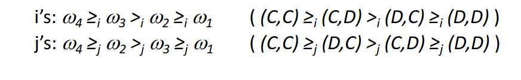
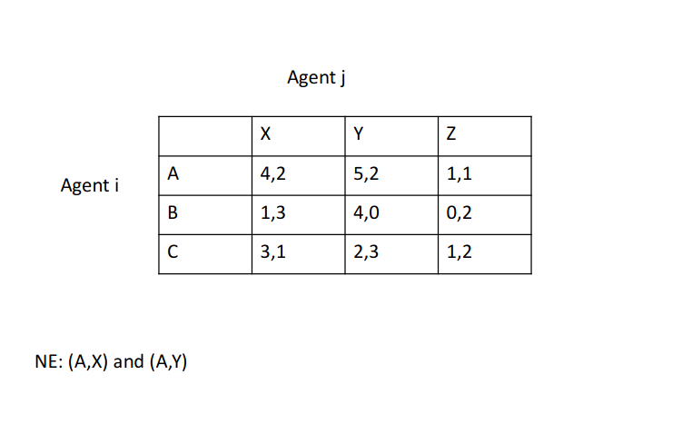

# Lecture 11 - Multiagent-Systems and Game Theory
## Agent Design (micro) vs. Society Design (macro)
__Micro-questions:__
* How do we build agents that are capable of independent, autonomous actions in order to successfully carry out the tasks that we delegate them?

__Macro-questions:__
* Types and characteristics of interactions between agents, interaction protocols
* Behaviour in societies of self-interested agents?
  * Cooperative
  * Competitive
## Game theory
* Studies the decisions of agents in a multiagent environment where
  * Actions of each agent have an effect in the environment
  * So, outcome of an action of one agent may depend on other agents' actions
  * Hence, "strategical decision" making
## Strategical Reasoning
* An agent's decision depends in what it reasons/thinks the other agent(s) will do.
  * The agent is __uncertain__ about the decisions (i.e., acitons) of the other participating agent.
  * Tries to predict other's next decisions
  * Computes how these affect him/her
  * Makes own decisions accordingly
## Let us play
* Pretend we are playing a game. Here's how it works. You must choose a number, $x$, between $[0, 100].$
* Assume we would then calculate the average of all the numbers. Then the person whose number is closest to $2/3$ of the average will win.
* _In case of a tie, the prize will go to a person chosen randomly among the winners._
* Assume that everybody is rational
* You choose $x=??$
## Different types of games
* Sequential games - chapter $5$ in R&N
* Strategic/simultaneous normal form games - today
* Repeated games - very interesting
## Sequential (extensive form) games
* Turn taking
* At each point the agents may decide/change their strategy
* Representation: tree
* Example: tik tak toe, chess, go
## Example on sequential games: tic-tac-toe
Sequential games, represented as a tree

## Strategic normal form games
* One shot
* The agent chooses its strategy only once at the beginning of the game, and all agents take their actions simultaneously.
* Main issue: predict what the other agent(s) will play.
* Represented: payoff matrix (will see soon)
* Example: Prisoner's dilemma, battle of sexes, stag hunt
## Example 1: Prisoner's Dilemma
* Two men are collectively charged with a crime and held in separate cells.
  * If one confesses and the other does not, the confessor will be freed, and the other will be jailed for three years.
  * If both confesses, then each will be jailed for two years.
  * If neither confesses, then they will each be jailed for one year.
* They are both rational and both know the other is rational.
* No communication - no way of agreement.
* What kind of behavior would you expect them to display?

## Example 2: Stag Hunt
* Describes a conflict betwween safety and social ccoperation, "trust dilemma"
* Story is due to Jean-Jacques Rousseau: two individuals go out on a hunt. Each can individually choose to hunt a stag or hunt a hare.
* Each player must choose an action without knowing the choice of the other
* If an individual hunts a stag, he must have a cooperation of his partner in order to suceed. An individual can get a hare by himself, but a hare is worth much less than a stag.
* Each agent wants to do what the other does.
## Example 3: Battle of Sexes
* Jonathan and Sofie are married and they are in their offices on a Friday evening trying to figure out what they should do after work. They cannot get in touch with each other but would like to meet and spend the veening to a __movie or an opera.__
* Jonathan likes movies better while Sofie would rather go to an opera.
* However, being in love, the most important thing for them is to do something together; both view the night "wasted" unless they spend it together.
## Assumptions of Classical Game theory
* Agents are _rational_
  * They have well-defined objectives/preferences over a set of outcomes and
  * They choose the actions thay lead them to their preferred outcomes
* Agents have a common knowledge
  * The rules of the game
  * Know what other agents are rational and the others know that they know they are rational...
## Defining Strategical environments
Three main components
1. Players
2. Strategies/actions
3. Payoffs (utilities)
## A Simple Interaction Environment
* Assume we have just two agents, $Agent=\{i,j\}$
* All actions an agent $i$ can perform are $A_i={a_1,a_2,\dots}$
* All possible outcomes (i.e. outcome space) of the system are $\Omega=\{\omega_1,\omega_2,\dots\}$ where $\omega$ represents an outcome corresponding to a collection of actions, one for each agent
* Hence, actual outcome $\omega$ depends on the combination of actions taken by $i$ and $j$
* So, environmental behaviour is given by the state transformer function:
$$\tau:A_i\times A_j\rightarrow\Omega$$
## State Transformer Function
* Assume each agent has just two possible actions that it can perform, $C$ and $D.$
* Here is an environment controlled by agent $j$ _only:_
$$\tau(D,D)=\omega_1\quad\tau(D,C)=\omega_2\quad\tau(C,D)=\omega_1\quad\tau(C,C)=\omega_2$$
* Now, a state transformer function of an environemt which is sensitive
$$\tau(D,D)=\omega_1\quad\tau(D,C)=\omega_2\quad\tau(C,D)=\omega_3\quad\tau(C,C)=\omega_4$$
* And here is another environment where none of the agent has any influence:
$$\tau(D,D)=\omega_1\quad\tau(D,C)=\omega_1\quad\tau(C,D)=\omega_1\quad\tau(C,C)=\omega_1$$
## Strategic Normal Games
A game in strategic normal form is defined by:
1. Agents $(N>1)$
2. Actions:
    * Each agent $i$ chooses an action $a_i$ from its own action set $A_i$
    * The vector $a=(a_1,\dots,a_n)$ of individual actions is alled a __joint action__ (or __action profile__ or strategy profile). The set $A$ is the set of all joint ations.
    
3. Utility function:
   * Each agent $i$ has its own utility function $u_i(a)$ that measures the goodness of the joint actions.
   * Each agent may give different preferences to different joint actions.
   * A __payoff matrix__ representation shows the utilities of __joint actions__ for each agent (_coming soon_)
## Utility Function
* Suppose we have the case where both agents can influence the outcome and Action={a,b}, i.e., each agent has just two possible ations that it can perform. Four possible different outcomes can be produced by the system:
$$\tau(a,a)=\omega_1\quad\tau(a,b)=\omega_2\\
\tau(b,a)=\omega_3\quad\tau(b,b)=\omega_4$$
* Suppose the agents have utility function as follows:
$$u_i(\omega_1)=1\quad u_i(\omega_2)=1\quad u_i(\omega_3)=4\quad u_i(\omega_4)=4\\
u_j(\omega_1)=1\quad u_j(\omega_2)=4\quad u_j(\omega_3)=1\quad u_j(\omega_4)=4$$
## Utility/Payoff Matrix
* Assume agent $i$ has $A_i=\{a,b\}$ and agent $j$ has $A_j=\{c,d\}$
* Agent's utilities are shown as a payoff matrix

* The payoff $u_1$ is the utility for agent $i$ when agent $i$ chooses action $a$ and agent $j$ chooses action $c.$
* The payoff $u_2$ is the utility for agent $j$ when agent $i$ chooses action $a$ and agent $j$ chooses action $c.$
## Utilities and Preferences
* Agent's preferences over outcomes are captured by utility funtions:
$$u:\Omega\rightarrow\R$$
* Utility functions lead to preference orderings over outcomes:
$\omega>_i\omega'$ iff $u_i(\omega)>u_i(\omega')$ where $u_i$ is the utility fn of agent $i$
* Hence, $\omega>_j\omega'$ iff $u_j(\omega)>u_j(\omega')$
* Suppose the agents have utility functions as follows
$$u_i(\omega_1)=1\quad u_i(\omega_2)=1\quad u_i(\omega_3)=4\quad u_i(\omega_4)=4\\
u_j(\omega_1)=1\quad u_j(\omega_2)=4\quad u_j(\omega_3)=1\quad u_j(\omega_4)=4$$
where $\omega_1=\{D,D\}, \omega_2=\{D,C\}, \omega_3=\{C,D\}, \omega_4=\{C,C\},$
* We say agent $i$ and $j$'s preferences (over outcomes) are as follows:

* If you ware agent $i,$ what would you prefer to do, $C$ or $D?$ Why?
## Rational action
* We can characterize this scenario (preceding slide) in this payoff matrix:

* $C$ is the rational choise for $i$, because $i$ prefers all outcomes that arise through $C$ over all outcomes that arise through $D,$ no matter what $j$ does. Indeed both agents prefer $C$ independently from each together!
* In this situation agents do not need to worry about what the other agent will do - __no "strategic thinking".__
## Prisoner's Dilemma

* Confess = defect
* Stay silent = cooperate
* Note that the numbers of the payoff matrix do not refer to years in prison but how good an outcoe is for the agent, the shorter time in jail the better.
* Top left: Reward for mutual ccooperation  ($1$ year each).
* Top right: If $i$ cooperates and $j$ defects, $i$ gets sucker's payoff of $1,$ while $j$ gets $4$ (zero vs. 3 years)
* Bottom left: If $j$ cooperates and $i$ defects, $j$ gets sucker's payoff of $1,$ while $i$ gets $4$ (zero vs. 3 years)
* If both defect, then both get punishment for mutual defection (e.g., 2 years each)
## Canonical PD payoff matrix

Applies when this condition holds:
$$T>R>P>S$$
## Solution Concepts
* A solution to a game is a prediction of the outcome of the game using the assumption that all agents are rational and strategic.
* How does the game theory predict?
  * Strictly (Strongly) / weakly dominant equilibriums.
  * Iterated elimination of dominated actions
  * Nash equilibrium
## Strictly Dominant Strategy (SDS)
__Example:__

* Preferences:

* "Defect" is the __strictly dominant strategy__ for both agents.
* $(D,D)$ is the strictly (also called __strongly__) dominant strategy equilibrium.
## Strictly Dominant Strategy Equilibrium
* An action is strictly dominant if it strictly dominates every action in $A_i.$
* __A dominant action must be unique, and when it exists, a rationa agent will choose it.__
* The strictly dominant strategy equilibrium is the joint strategy where all the agents choose the strictly dominant action.
## Strictly Dominant Strategy (SDS) - formal
* $A$ is the set of all joint actions.
* $a_{-i}$ is a joint action taken by all players other than $i.$
* $A_{-i}$ is the set of joint actions except the action of agent $i,$ i.e., $a_{-i}\in A_{-i}.$
* Given a game in strategic normal form, an action $a_i\in A_i$ for all player/agent $i$ <u>strictly dominates</u> action $b_i\in A_i$ if
$$U_i(a_i, a_{-i})>U_i(b_i, a_{-i})\quad\forall a_{-i}\in A_{-i}$$
## SDS equilibrium Example 2
* Does this game have a dominant strategy for agent $i?$
* For agent $j?$

* Preferences

* Action $b$ is a strictly dominant action for agent $i.$
* Action $b$ is a strictly dominant action for agent $j.$
* Thus $(b,b)$ is a strictly dominant strategy equilibrium.
## Definition: Weakly Dominant Strategy (WDS)
* $a_i$ weakly __dominates__ $b_i$ if
  * $u_i(a_i, a_{-i})\geq u_i(b_i, a_{-i})\quad\forall a_{-i}\in A_{-i}$ and
  * $u_i(a_i, a_{-i})>u_i(b_i, a_{-i})\quad\text{ for some } a_{-i}\in A_{-i}$
* It is called weakly dominant if it weakly dominates every action in $A_i.$
## Solution Concept: WDS equilibrium
Example:

* There is no strongly dominant strategy for each agent here.
* Action $b$ is a weakly dominant strategy for both agent $i$ and agent $j$
* Therefore $(b,b)$ is a weakly dominant strategy equilibrium.
* Rational agents will usually play this strategy.
## Example: No Dominant Strategy at all

* The game has no dominant strategy equilibrium.
## Solution Concept: Iterated elimination of Dominant strategies (IEDS)
* This solution may be used in games where there is no dominant strategy equilibrium.
* Required Common knowledge:
  * Each agent knows that the other is also rational.
  * All players know everybody's payoff functions.
* __A rational agent will never choose a suboptimal action, i.e., a dominated action.__
* IESD is a solution technique that iteratively eliminates strictly dominated actions from all agents until no more actions are strictly dominated.
## Definition: Strictly/weakly dominated

* Take a game in strategic form and consider any two actions $a_i, b_i\in A_i$ for any player $i\in N.$ We say that $a_i$ is __strictly dominated__ by $b_i$ if
$$u_i(a_i, a_{-i})<u_i(b_i, a_{-i})\quad\forall a_{-i}\in A_{-i}$$
* We say that $a_i$ is __weakly dominated__ by $b_i$ if
  * $u_i(a_i, a_{-i})\leq u_i(b_i, a_{-i})\quad\forall a_{-i}\in A_{-i}$ and
  * $u_i(a_i, a_{-i})<u_i(b_i, a_{-i})\quad\text{ for some } a_{-i}\in A_{-i}$
## IEDS Example

* $R$ is strictly dominated for agent $j$ (by action $M$)
* We eliminate $R$ because agent $i,$ being rational, knows that agent $j$ will not play $R.$
* Now agent $j$ notices that $D$ is strictly dominated for agent $i.$ Agent $j$ eliminated in his head the ation for agent $i.$
* Eliminate $L$ for agent $j$.
* The order of elimination does not matter in IESD.
## Example: Iterated elimination of weakly dominated actions (IEWDS)
* If no strongly dominated actions, then use weakly dominated ones to eliminate

* Does the order matter?
* Start with eliminating $U$
* Start with $M$
## IESDS/IEWDS - problems
* Different outcomes may arise as outcomes that survive, depending on the order of elimination in IEWDS.
* There may be left more than one solution after elimination.
* Hence, need a stronger solution concept.
  * Nash equilibrium.
## Definitions: Pareto Optimality and Social Welfare
Two important notions for comparison and selection of solutions; How good is a solution?
1. Pareto optimality
2. Social welfare maximization
## Pareto optimality (efficiency) - defn.
* A solution (i.e., a strategy profile, e.g., $(a_1, a_2,\dots, a_n)$) $S^P$ is Pareto optimal, if there is __no__ solution $S'$ with:
  * $\exists$ agent $i:U_i(S')>U_i(S^P)$ and
  * $\forall$ ageng $j:U_j(S')\geq U_j(S^P)$ i.e., none of the others are worse off
* In plain english: there is no other outcome where some agentcs can increase their payoffs without decreasing the payoffs of other agents.
## Example on pareto optimality

* Which joint action(s) is/are pareto optimal?
  * $(A,A):$ optimal because no other outcome makes an agent better without making the other worse.
  * $(A,B):$ optimal, because payoff "7" of agent1 can be improved but then agent2 is worse off.
  * $(B,A):$ optimal
  * $(B,B):$ Not optimal. Both agents are better off when they shift to $(A,A)$
## Social Welfare - defn.
* Social welfare value (of a solution)
  * Sum of utilities of all agents for this strategy profile.
  * If a solution maximizes social welfare (i.e., social optimum), then the available utilities are not wasted.
* if a solution is a social optimum, then it is Pareto efficient.
  * The converse does not hold.
## Solution concept: Nash Equilibrium - Definition
* __Nash equilibrium__ is a strategy profile (i.e., a collection of strategies, one for each player) such that each strategy is a __best response__ (maximizes payoff) to all the other agents' strategies.
* The best response of agent $i$ is given by $BR_i(a_{-i})=\{a_i\in A_i: u_i(a_i, a_{-i})\geq u_i(b_i, a_{-i}\text{ for all }b_i\in A_i)\}.$
* Best response for each agent gives the set of payoff maximizing strategies for each strategy profile of the other player.
## How to find the Nash equilibrium(s)
* One way of finding Nash eq. in two-person strategic form games is to utilize the best response correspondence in the payoff matrix.
* Mark the best response(s) of each agent given the action choice of the other agent. A strategy profile where best response of all agents intersect is a Nash equilibrium (not necessarily a singleton set)
* The Nash equilibriums are $(x,x)$ and $(y,y).$

## Finding NE - example

## Finding NE - another example

## Example: Prisoner's Dilemma

* The strategy profile (defect, defect) is a Nash Equilibrium.
  * If agent $i$ changes its strategy (defect) to cooperate - the new situation is (cooperate, defect) - agent $i$ will be worse off (payoff from 2 to 1).
  * If $j$ changes its strategy (defect $\rightarrow$ cooperate) it will be worse off (payoff, again, from 2 to 1).
* So defection is the best response to all possible strategies
* Pareto optimal: $(C,D), (D,C)$ and $(C,C)$
* Socially welfare maximizing: $(C,C)$
* The solution is $(D,D)$
  * Unique Nash (also strongly dominant strategy profile) is not Pareto optimal
  * Not socially (welfare) maximizing
* Intution says this is not the best outcome - not social optimum. Surely they should both cooperate and each get payoff of 3!
* This apparent paradox is the fundamental problem of multi-agent interactions.
## Multiple Nash equilibria

* Not every interaction scenario has a single Nash equilibrium.
* Consider two agents of whom chooses either l (left) or r (right). If their choice do not match, they receive a payoff of zero.
* There are two Nash equilibriums, $(l,l)$ and $(r,r).$
* The two Nash Equilibriums are not equal. Would the agents possibly "agree" (coordinate) upon one of the solutions?
  * $(r,r)$ is _social optimum_
* This type of game is known as "pure coordination game"
## Example: Multiple Nash equilibria - Battle of sexes

* The story: Two individuals (a woman and a man) are arguing abot what to do for entertainment in the evening.
* The couple is in love, to the most important thing is to do something together; both view the night "wasted" unless they spend it together.
* Given agent $i$ plays $m$, the best response for agent $j$ is to play $m,$ which is expressed by underscoring player $j$'s payoff at $(m,m)$ and its best response to $o$ is $o$.
* Similar for agent $j,$ and the Nash equilibria are
  * $(m,m)$ and $(o,o)$. No strict equilibrium.
* Hence, they agree that cooperation is better but "disagree" about the best outcome.
## Example: Multiple Nash equilibria - Stag Hunt
Two individuals go out on a hunt. Each can individually choose to hunt a stag or hunt a hare. If an individual hunts a stag, he must have a cooperation of his partner in order to suceed. An individual can get a hare by himself, but a hare is worth much less than a stag.
* Each agent wants to do what the other does - which may be different than what they _say_ they'll do.
* Coordination game

* Two pure Nash equilibria: $(H,H)$ and $(S,S).$
* $(S,S)$ is pareto optimal/payoff dominant (more payoff) while $(H,H)$ is risk dominant (less risky).
* Higher payoff vs safer?
* If one agent trusts the other (that she will cooperate to hunt stag). But if... So, hunting stags is most beneficial for society but requires a lot of trust among its members.
## Stag Hung - solution selection
* Conflicting opinions
* Haranyi and Selten (1988) propose that the payoff dominant equilibrium is the __rational choice__ in the stag hunt game
* Haranyi (1995) changes this conclusion to take risk dominance as the relevant selection criterion.
## Changing the environment/norms in Stag hunt game?
* If both agents hunt a hare the hares will be given to others.
* If only one catches a hare (whilst the other tries Stag) then the two agents will share the hare
* How would you hunt?
## No Nash Equilibrium
* There is no Nash in Zero-sum interactions
* Zero-sum games: preferences of agents are diametrically opposed, we have __strictly competitive__ scenarios.
* Zero_sum encounters are those where utilities sum to zero.
$$u_i(\omega)+u_j(\omega)=0\quad\forall\omega\in\Omega,\text{ where }\omega\text{ is an outcome}$$
## Zero-sum - Example

* Mathing pennies game
* Two agents. Each chooses either Head or Tail simultaneously. If the choice differ, agent $i$ pays agent $j$ (let's say 100 NOK). If they choose the same, agent $j$ pays agent $i$.
* No possibility for cooperation or coordination or anything.
* What may happen?
## Mixed Strategies

* No Nash: Because in Nash, the players don't change their strategies even when they know what the other agent will play.
* Here for every strategy pair, there is an agent that may want to change his strategy to get more payoff.
* Hence, no __pure__ strategy equilibrium?
* What now? Randomized behaviour: Mixed strategies
## Repeated games
* Focus: remembering past behaviour of others, strategies based on past behaviour of other agents.
* Main issue: evolution of cooperation, learning, opponent modelling
* Example: prisoner's dilemma repeatedly played
## Iterated Prisoner's Dilemma
* How to evolve cooperation?
  * One answer: play the game more than once.
* If you know you will be meeting your opponent again, then the incentive to defect appears to evaporate 
## Axelrod's Tournament
* Suppose you play iterated prisoner's dilemma against a range of opponents. What strategy should you choose, so as to maximize your overall payoff?
* Axelrod (1984) investigated this problem with a computer tournament for programs playing the prisoner's dilemma.
* In the tournament, programs played games against each other and themselves repeatedly.
## Strategies in Axelrod's Tournament
* ALLD
  * Always defect - the hawk strategy
* RANDOM
  * Selects either cooperate or defect on random.
* TIT-FOR-TAL
  * On round $t=0,$ cooperate
  * On round $t>0,$ do what your opponent did on round $t-1.$
* TESTER
  * On 1st round defect. If the opponent ever retaliated with defection, then play TIT-FOR-TAT. Otherwise play a repeated sequence of cooperating for two rounds, then defecting.
* JOSS
  * As TIT-FOR-TAT, except periodically defect.
## Recipes for Success in Axelrod's Tournament
Axelrod suggested the following rules for succeeding in his tournament:
* __Don't be envious:__
  * Don't Play as if it were zero sum!
* __Be nice:__
  * Start by cooperating, and reciprocate cooperation
* __Retaliate appropiately:__
  * Always punish defection immediately, but use "measured" force - don't overdo it.
* __Don't hold grudges:__
  * Always reciprocate cooperation immediately.

