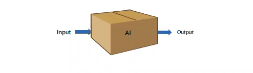

# Lecture 12 - Part 2 - Artificial Intelligence and Ethics
## The Emergence of AI-Ethical Principles
In the last few years, a number of institutions have published AI principles:
*  The Asilomar AI principles (Future of Life Institute, 2017
*  Principles for Algorithmic Transparency and Accountability (ACM2017).
*  IEEEs General Principles of Ethical Autonomous and Intelligent Systems (IEEE 2017)
*  Five principles for a cross-sector AI code (UK House of Lords, 2018)
*  AI ethics principles (Google, 2018)
*  Ethics guidelines for trustworthy AI (European Commission, 2019)
*  ...
## An older one: Asimov's Three Laws of Robotics
* A robot may not injure a human being or, through inaction, allow an human being come to harm;
* A robot must obey the orders given it by human beings except where such orders would conflict with the First Law;
* A robot must protect its own existence as long as such protection does not conflict with the First or Second Laws.

'Runaround' (1942), Isaac Asimov
## Example: The 7 EU principles
* Human agency and oversight: AI systems should empower human beings, allowing them to make informed decisions.
* Technical Robustness and safety: AI systems need to be resilient and secure. They need to be safe, ensuring a fall back plan in case something goes wrong.
* Privacy and data governance: besides ensuring full respect for privacy and data protection, adequate data governance mechanisms must also be ensured
* Transparency: the data, system and AI business models should be transparent
* Diversity, non-discrimination and fairness: Unfair bias must be avoided
* Societal and environmental well-being: AI systems should benefit all human beings
* Accountability: Mechanisms should be put in place to ensure responsibility and accountability for AI systems
## Common Grounds
There are many different lists of principles, but it seems that they all can be synthesized into five key principles
* autonomy (people should be able to make their own decisions, e.g., human-in-the-loop, privacy protection)
* beneficence (society at large should benefits)
* non-maleficence (harmful consequences should be avoided, e.g., systems should be robust)
* justice (diversity, non-discrimination and fariness)
* explicability (transperancy and explainability)
## Problems with Principles
It is good to state principles! Howeber they also create problems since they are very high-level.
* They can be interpreted in different ways.
  * For example, autonomous killer drones can be considered as being beneficient for the soliders, or being morally impermissible, because machines decide about life and death
* They can conflict with each other in concrete cases.
  * For example, privacy and data collection for health science can conflict
* They can come into conflict in practise
  * For example, an excellent diagnosis might still be preferable even if its reasoning cannot be explained

It is nevertheless good to have such principles as orientation points along one can evaluate solutions.
## Artificial Intelligence$\ne $ Machine Learning
* In this course we looked at mainstream AI, and not Machine learning
* Unbelievable many times ML is considered as if it is AI, but it is only a subfield of it
* Main (and very important difference) between mainstream AI (Good old fashioned AI, knowledge-based systems) and the vast majority of machine learning (e.g., Neural networks) is:
  * Mainstream AI is knowledge-driven while majority of ML is data-driven
  * ML uses "labelles" data points (many of them) as examples and the system generates a model of this data, and then use this model to tell something about a new data (representing for example a person applying for a job)
  * This type of ML systems are called "black box"
## ML-pipeline
The "reasoning" processes underlying machine learning systems.

## Why/when AI-fairness is important?
Many things become automated by machine learning:
* employers select candidates by using ML systems.
* LinkedIn and XING use ML systems to rank candidates
* Courts in the US use ML systems to predict recidivism
* Banks use credit rating systems, which use ML
* Amazon and Netflix use recommender systems
* If these systems act unfair, groups and individuals may suffer
## Why AI-fairness is important
* Discrimination in a social sense of the word is prejudiced __treatment__ of people based on perceived membership in certain classes, groups or categories, often called _protected classes._ The attribute that defines a protected class is called a _sensitive attribute_, e.g., gender, race, religion, disability, or age.
* Unfairness is to limit people's life chances based not on merits but based on sensitive attributes like gender or race.
* In some cases it is unintended discrimination, where different groups receive different outcomes or treatment even though their protected class membership was not explicitly considered in the decision process. This is called __disparate impact.__
## Unfairness in ML
* Where is the problem?
* Where to look at?
* How to measure it?
* How to solve it?

## Source of Bias in Data

## COMPAS example to Fairness
* This example is a very famous one creating hot debates in Fairness research and practise.
* It is about a system called COMPAS designed for predicting which criminals will reoffend.
* It is used by judges for risk estimation, across USA.

## Performance of an AI system

* In this course we talked about PEAS (i.e. performance, environment, actuators, sensors), and defined rational behaviour as
  * _an agent's taking actions that maximize the expected value of the __performance measure__ given the percept sequrnce so far._
* Performance of an agent is measured through its "objective function"

## Objective function
* can be defined either as cost/loss function (to be minimized) or utility/profit/fitness function (to be maximized)
* and can be evaluated to a value, e.g., 90% of the dirt sucked, fruit classes are predicted with 70% accuracy.

Traditionally, objective function does not include ethical considerations such as fairness, privacy etc.
* ... And adding "ethical objective aspects" to the objective function may interfere with the measures of traditional objective function
* Often there is a tradeoff between for example accuracy and fairness measures.
## Perspective on Ethics in Philosophy
* Different perspectives in Ethics in Philosophy:
  * Deontological
  * Consequentialist
  * Utilitarian
  * Virtue
## Deontological vs Consequentialism
From "Stanford Encyclopedia of Philosophy":
* In comtemporary moral philosophy, deontology is one of those kinds of normative theories regarding which choices are morally required, forbidden, or permitted. In other words,
* deontology falls within the domain of moral theories that guide and assess _our choices_ of what we ought to do (deontic theories), in contrast to those that guide and assess _what kind of person we are_ and should be ("virtue" theories).
## Deontological approach
* Deontologist's claim: some actions have inherent moral value - as required, forbidden, etc.
* Whether an act is morally right or wrong depends on whether it is in conformity or conflict with moral duties and rights.
* Moral principles and rules.
## Consequentialist approach (from Stanford Encyclopedia)
Consequentialists hold that choices - acts and/or intentions - are to be morally assessed solely by the states of affairs they bring about. Consequentialists thus must specify initially the states of affairs that are intrinsically valuable - often called, collectively, "the Good." They then are in a position to assert that whetver choices increate the Good, that is, bring about more of it, are the choices that it is morally right to make and to execute. (The Good in that sense is said to be prior to "the Right.")

Consequentialists can and do differ widely in terms of specifying the Good. Some consequentialists are monists about the Good. Utilitarians, for example, identify the Good with pleasure, happiness, desire satisfaction, or "welfare" in some other sense. Other consequentialists are pluralists regarding the Good. Some of such pluralists belive that how the Good is distributed among persons (or all sentient beings) is itself partly constitutive of the Good, whereas conventional utilitarians merely add or average each person's share of the Good to achieve the Good's maximization.
## Moral Machines?
* Philosophers usually consider machines as not capable of making moral decisions.
* Howeveer, one can try to find properties such that machines could act morally.
* Machines need to have at least
  * beliefs about the world
  * intentions
  * moral knowledge
  * the possibility to compute the consequences ones own actions can have, in which case they can be considered as moral agents.
## Famous "Trolley Problem" and Autonomous driving

* The story goes like this: There is a runaway trolley barrelling down the railway tracks. Ahead, on the tracks, there are five people tied up and unable to move. The trolley is headed straight for them. You are standing some distance off in the train yard, next to a lever. If you pull this lever, the trolley will switch to a different set of tracks. However, you notice that there is one person on the side track. You have two options:
  * Do nothing and allow the trolley to kill the five people on the main track.
  * Pull the lever, diverting the trolley onto the side track where it will kill one person.
* What is the more ethicla option? Or, more simply: What is the right thing to do?
* Trolley problems highlight the difference between deontological and consequentialist ethical systems. The central question that these dilemmas bring to light is on whether or not it is right to actively inhibit the utility of an individual of doing so produces a greater utility for other individuals.
## Summary
* If a new AI winter arises, it will be due to ethical problems
* What are the main ethical concerns
* Several AI-ethics Regulations
* Philosophical approaches to ethics and morality
* AI is not equal to Machine Learning
* Why and how unfairness (and discrimination) occur in ML?
* Fairness definitions and metrics - some
* About migitations of fairness
* Trolley problem and the link to Consequentialism (in Philosophy of ethics)

