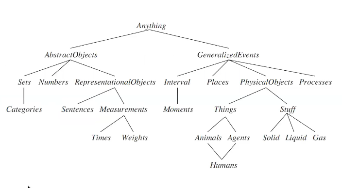

# Lecture 12 - Part 1 - Knowledge Representation
## Knowledge-based systems

"Knowledge is knowing that a tomato is a fruit, wisdom is not putting it in a fruit salad." - _Miles Kington_
## Knowledge Acquisition
Knowledge acquisition is the part of the job of Knowledge engineer.

__Knowledge engineer:__
* decides the content and organization of the knowledge required for the domain specific KB
* acquires this knowledge into the KB

__Knowledge acquisition techniques:__
* Traditional: working together with human experts - manual work
* Recent: from databases, text and data - information extraction and knowledge discovery.
## Ontological engineering
* How to create more general and flexible representations
  * Concepts like actions, time, physical objects, beliefs
  * Operates on a bigger scale than knowledge engineering
* Define general framework of concepts
  * Upper ontology
## The upper ontology of the world

## Difference with special-purpose ontologies
* A general-purpose ontology should be applicable in more or less any special-purpose domain
  * Add domain-specific axioms
* In any sufficiently demanding domain different areas of knowledge need to be unified
  * Reasoning and problems solving involve several areas simultaneously
* What do we need to express?
  * Categories, measures, composite objects, time, space, change, events, processes, physical objects, substances, mental objects, beliefs
## IBM Watson: Example of the power of knowledge
https://www.youtube.com/watch?v=_Xcmh1LQB9I
## KR languages
* __Main requirements for KR languages:__
  * Expressive power
  * Inferential adaquacy
  * Modifiability
  * Readability
* __Typical KR languages:__
  * Logic
  * Semantic networks
  * Frames
  * Description Logic
  * Production Rules
## Categories and objects
* Knowledge representation requires the organisation of objects into categories
  * Interaction at the level of the objects
  * Reasoning at the level of categories
* For example, Category-subcategory relationship
  * defines a taxonomy
  * enables Reasoning through __Inheritance__
* Example: All instances of Food are edible, Fruits is a subclass of Food, and Apples is a subclass of Fuit, then an apple is edible.
## Role of Categories in Reasoning
* Categories play a role in the __predictions__ about objects
  * Based on __perceived properties:__ An object that is orange colour, spherical with $10$ cm diameter and smells. Can this be edible?
  * IN KB: Orange is a fruit. All fruits are edible. Orange category has the same properties that the perceived object has.
  * Predict: It can be eaten
## Expressive power of logic
* Limitations of logic representations
  * Exceptions. Elephants are grey. But Eli, which is an elephant, is blue. Possible to represent in logic?
  * Uncertainty, e.g., tomatoes can be red, green or yellow
* We will use however FOL to discuss content and organization of knowledge. FOL can easily state facts about categories
## First-order logic and categories
* An object is a member of a category
  * $BB_{12}\in Basketballs$
  * Member(BB12, Basketballs)
* A category is a subclass of another category
  * $Basketballs\subset Balls$
  * Subcategory(Basketballs, Balls)
* All members of a category have some properties
  * $(x\in Basketballs)\implies Spherical(x)$
* All members of a category can be recognized by some properties
  * $Orange(x)\wedge Round(x)\wedge Diameter(x)=9.5"\wedge x\in Balls\implies x\in Basketballs$
## Relations between categories
* __Disjoint:__ Two or more categories are disjoint if they have no members in common
  * $Disjoint(\{Animals, Vegetables\})$
* __Exhaustive Decomposition:__ A set of categories $s$ constitutes an exhaustive decomposition of a category $c$ if all members of the set $c$ are covered by categories in $s$
  * $ExhaustiveDecomposition(\{Americans, Canadians, Mexicans\}, NorthAmerican)$
* __Partition:__ A disjoint exhaustive decomposition is a partition
  * $Partition(\{Archaea, Bacteria, Eukarya\}, LivingThings)$
## Natural kinds
* Many categories have no clear-cut definitions (chair, bush, book)
* Tomatoes: sometimes green, red, yellow, black. Mostly round and mostly red.
* One solution: category $Typical(Tomatoes)$
  * $x\in Typical(Tomatoes)\implies Red(x)\wedge Spherical(x)$
* We can write down useful facts about categories without providing exact definitions
## Physical composition
* One object may be part of another
$PartOf(Bucharest, Romania)\\
PartOf(Romania, EasternEurope)\\
PartOf(EasternEurope, Europe)\\
PartOf(Europe, Earth)$
* The $PartOf$ predicate is transitive reflexive and transitive
$PartOf(x,x)\\
PartOf(x,y)\wedge PartOf(y,z)\implies PartOf(x,z)$
* So we can infer that $PartOf(Bucharest, Earth)$
* __Composite objects__ are often characterized by structural relations among parts
## Event calculus
* Addresses what happens __during__ the action.
* Example: $At(Knut, NTNU)$ refers to the fact of Knut being at NTNU, but does not say whether it is true.
* For this we need the predicate $T:$
  * $T(At(Knut, NTNU), t)$
## Time intervals
* Represented as an interval $i=(start,end)$
* $T(f,t)\quad f$ is true at time $t$
* $Happens(e,i)\quad e$ happens over the tame interval $i$
* $Initiates(e,f,t)\quad e$ causes $f$ to start to hold at time $t$
* $Terminates(e,f,t)\quad e$ causes $f$ to cease to hold at time $t$
* $Clipped(f,i)\quad f$ ceases to be true at some point during interval $i$
* $Restored(f,i)\quad f$ becomes true sometime during interval $i$
## Mental events and objects
* So far, knowledge based agents can have beliefs and deduce new beliefs
* What about __knowledge about__ beliefs? What about knowledge about the inference process?
* Requires a model of the __mental objects__ in someones head and the processes that manipulate these objects
* __Relationships__ between agents and mental objects:
  * believes,
  * knows,
  * wants,
  * ...
* Example: $Believes(Lois, Flies(Superman))$ with $Flies(Superman)$ being a candidate for a __mental object__
* An agent can now reason about the beliefs of agents
## Intrinsic and Extrincic properties
* Stuff versus things, e.g. butter versus elephant
* count nouns versus mass nouns in linguistics
* an instance of stuff continues to be stuff when divided but not things
* instances of stuff have intrinsic properties that belong to the substance, e.g., butter has property _smelting point_
* instances of thing have extrinsic properties, e.g. weight.
## Semantic Networks, Quillian
* Developed by Ross Quillian, as "a psychological model of associative memory" (1968).
* Associationist theories define the meaning og an object in terms of a network of associations with other objects in a domain or a knowledge base.
* Quillian experimented with human objects:
* The structure of the network was devised from laboratory testing of human response times to question such as "Is a canary a bird?", "Can a canary sing?", "Is a canary yellow?", or "Can a canary fly?"
## Quillian experiments
* Experiment: E.g., "Can a canary fly?" needed longer response time than "Can a canary sing?"
* Quillian: humans organize knowledge herarchically and store information at its most abstract level.
* Reduces the size of the knowledge base; prevents update inconsistencies
## Semantic networks
* Logic vs semantic networks
* __Main idea:__ Knowledge is not a large collection of small pieces of knowledge but larger pieces that are highly interconnected. The meaning of a concept emerges from how it is connected to other concepts.
* __Efficient algorithms:__ for a category membership inference using inheritance reasoning
  * Female persons inherit all properties from person
  * Similar to object-oriented programming
* Inference of __inverse links__, e.g., $SisterOf$ vs. $HasSister$
## Semantic network example

## Multiple inheritance

White - Royal Elephant is more specific than Elephant.

Use model preference. E.g., religious belief may be given preference over political beliefs.
## Frame-based representations - example
* A Frame consists of a number of slots.
* A slot consists of a variable (a property) which has a value

## Frame-based representations
* Semantic networks where nodes have structure
* Frame with a number of slots (age, height, ...)
* Each slot stores specific items of information - attribute-value or slot-filler pairs
* When agent faces a new situation - Slots can be filled in (value may be another frame)
* Filling in may trigger actions
* May trigger retrieval of other frames
* Inhertiance of properties between frames
* Very similar to objects in OOP
## Frame-based representations - example
* Logic and semantic networks are declarative knowledge representatiojn languages.
* Frame-based languages are also mainly declarative but can also represent procedural knowledge through __demons__

## Reasoning with default information
* FOL is monotonic which is limiting - the set of entailed sentences can only increase.
* If $KB\models\alpha$ then $KB\wedge\beta\models\alpha$
* __Nonmonotonic logic,__ e.g.,:
  * Circumscription
  * Default logic
## Circumscription
* Introduced by McCarthy: "A bird will fly if it is not abnormal."
* McCarthy introduces an $ab$ predicate into the default reasoning rule:
  * $(\forall x)[(bird(x)\wedge\neg ab(x))\rightarrow flies(x)]$
  * If there is no proof given by the logic that $ab(x),$ we can "circumscript" the $ab$ predicate and assume that it is not true.
* Given the premises
  * $(\forall x)[penguin(x)\rightarrow\neg flies(x)]$
  * $(\forall x)[penguin(x)\rightarrow\ bird(x)]$
  * $bird(Tweety)$
* If we add $penguin(Tweety)$ to the premises, then we can infer $ab(Tweety)$ by rewriting the default sentence like this:
  * $(\forall x)bird(x)\wedge\neg flies(x)\rightarrow ab(x)$

## Default logic
* Default rules that produce contingent conclusions.
* Example: $Bird(x):Flies(x)\char`\\ Flies(x)$ means "If $Bird(x)$ is true and $Fliex(x)$ is consistent with KB then $Flies(x)$ can be concluded by default.
* A default rule has $3$ components:
  * Prerequisite $(P),$
  * Justification $(J),$
  * Conclusion $(C)$
* $P:J_1\dots,J_n\char`\\C$
* If $P$ and $J_1\dots,J_n$ cannot be proven false, then the conclusion can be drawn.
## Truth maintenance systems - nonmonotonicity
* Many of the inferences have default status rather than being absolutely certain
  * Inferred facts can be wrong and need to be retracted $=$ __belief revision__
  * Assume knowledge base contains sentence $P$ and we want to execute $Tell(KB,\neg P)$
  * To avoid contradiction: $Retract(KB,P)$
  * But what about sentences inferred from $P?$
* Truth maintenance systems are designed to handle these complications