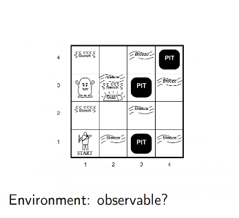
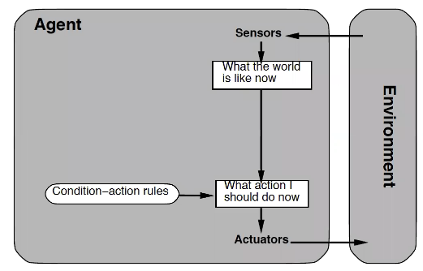

# Chapter 2 - Intelligent Agents
## Agents and environments

## Agent types
An agent is anything that can be viewed as perceiving its environment through sensors and acting upon that environment through actuators.

## Agent
* Human agent: eyes, ears, and other organs for sensors; hands, legs, mouth, and other body parts for actuators.

* Robotic agent: cameras and infrared range finders for sensors; various motors for actuators.
* Software agent: screen, keyboard, smart phones etc.
## Example: Vacuum-cleaner world

## Agent function - and program
An __agent function__ maps from percepts to actions:
$$f:\mathcal{P}\rightarrow\mathcal{A}$$
The __agent program__ runs on the physical _architecture_ to produce $f$

## Systems that act rationally
* Rational behavior: "doing the right thing". What is the __right thing__?
* May include thinking for action - action without thinking: ?
* Rationality can be defined and optimized
* On the other hand
  * perfect rationality is only feasible in ideal environments.
  * rationality is often not a very good model of reality. 
    * Humans are, e.g., very bad in estimating probabilities.
## Rational agent
A rational agent should select an action that is expected to maximize its performance measure, given
* the evidence provided by the percept sequence and
* whatever built-in knowledge the agent has

Rational $\implies$ exploration, learning, autonomy

An agent is __autonomous:__ takes its decisions (e.g., decide actions) according to the current situation, and changes their "plans" accordingly.

Sphex wasp relies on its innate "plan", hence lacks autonomy.
## Rationality depends on PEAS
__P:__ The _performance_ measure
__E:__ The agent's prior knowledge about the _environment_
__A:__ The _actions_ that the agent can perform
__S__ The percept _sequence_
## Design objects and rationality
* A rational agent performs actions in line with the design objectives.
* These objectives shape the performance measure
* Selected performance measure evaluates the __environment sequence__

* For example, in case of the vacuum cleaner, the designer should focus only on collecting as much dirt as possible in time $T$

* Or, take also other factors into account, e.g.:
  * amount of time taken to clean
  * amount of electricity consumed
  * amount of noise generated, etc
* e.g., one point per square cleaned up in time $T,$ or
  * one point per clean square per time step, minus one per move
  * etc
## PEAS
To design a rational agent, we must specify the __PEAS__
Consider, e.g., designing an automated taxi:
__Performance measure??__
__Environment??__
__Actuators??__
__Sensors??__
## Automated taxi
* __Performance measure:__ safety, destination, profits, legality, comfort
* __Environment:__ streets/highway, traffic, pedestrians, weather
* __Actuators:__ steering, accelerator, brake, horn, speaker/display
* __Sensors:__ video, accelerometers, gauges, engine sensors, GPS
## Internet shopping agent
* __Performance measure:__ price, quality, appropiateness, efficiency
* __Environment:__ current and future WWW sites, vendors, shippers
* __Actuators:__ display to user, follow URL, fill in form
* __Sensors:__ HTML pages (text, graphics, scripts)
## Medical diagnosis system agent
* __Performance measure:__ healthy patient, minimize costs, lawsuits
* __Environment:__ patient, hospital, staff
* __Actuators:__ screen display (questions, tests, diagnoses, treatment, referrals)
* __Sensors:__ keyboard (entry of symptoms, findings, patient's answers)
## Properties of environments
__Fully observable environments__
* relevant parts of the state of the environment can be sensed
* no need to maintain any internal state to keep track of the world

__Partially observable environments__
* parts of the environment cannot be sensed
* agent must make informed guesses about the world
## Fully vs Partially Observable Environments - example

* squares adjacent to Wumpus are smelly
* squares adjacent Pit are breezy
* glitter iff gold is in the same square
* shooting kills wumpus if you are facing it
* only one arrow to shoot
## Fully vs Partially Observable Environments

## Properties of environments
__Deterministic environment__
* Any action has a single guaranteed effect, and no uncertainty/failure.

__Stochastic environment__
* There is some uncertainty about the outcome of an action
* Multiple outcome alternatives, quantified in terms of probabilities


__Episodic environments__
* The agent's experience is divided into atomic episodes.
* Each episode consists of the agent perceiving and then performing a single action
* The choice of action in each episodes depends only on the episode itself.

__Sequential environments__
* The current decision could affect all future decisions


__Discrete__
Finite number of distinct states, percepts and actions.

__Continuous__
Continuous time/state/actions


__Dynamic environments__
May change while an agent is deliberating

__Static environments__
The environment does not change

__Semidynamic__
The world does not change but the agent's performance score may


__Single agent__
No otger agents - there may be but as a part of the environment

__Multi-agent__
* Which entities will be viewed as "other agents"?
* The environment contains other agens whose performance measure depends on my actions and vice versa
* Competitive and cooperative interactions


__Known environments__
* The agent's knowledge about how the environment works/evolves.
* Note that a known environment (i.e., the agent knows all the rules that apply) may be only partially observable


__Unknown environment__
* The agent will have to learn how it works
* An unknown environment can be fully observable
## Environment type and agent design
__The environment type largely determines the agent design__

The real world is (of course) partially observable, stochastic, sequential, dynamic, continuous, multi-agent
## Agent Function
* The agent function will internally be represented by the agent program.
* The agent program runs on the physical architecture to produce $f.$


## A simple vacuum-cleaner agent
Table that maps percept sequences to actions

## A simple general agent
```
function Table-driven-Agent([percepts]) returns an action
  static: table, maps percepts to actions

  append percept to the end of percepts
  action <-- Lookup(percepts, table)
```
* looks up the right respone in the table
* Infeasible: if there are $|P|$ percepts and a life-time of $T,$ then need for a look-up table of size $\sum_{t=1}^T{|P|^t}$
## Agent programs
Writing down such agent functions is not feasible.

The goal of AI is to write agent programs with small code which produces the desired rational behaviour.
## Agent types
Four basic types in order of increasing generality:
* simple reflex agent
* model-based reflex agent
* goal-based agents
* utility-based agents
## Simple reflex agents

* Uses only the current percept - ignores the percept sequence
* Implemented through condition-action rules
* Large reduction in possible percept/action situations from $\sum_{t=1}^T{|P|^t}$ to $|P|$

Example:
```
function Reflex-Vacuum-Agent([location,status]) returns an action

  if status == Dirty then return Suck
  else if location == A then return Right
  else if location == B then return Left
```
## Generic Simple Reflex Agent program
A more general simple reflex agent program:
```
function Generic-SimpleReflexAgent( percept) returns an action
  static: rules

  state <-- Interpret(percept)
  rule <-- Rule-match(state)
  action <-- Rule-action(rule)
  return action
```
* Will only work if the environment is fully observable
* everything relevant needs to be determinable from the current input
* otherwise infinite loops may occur, e.g. in the vacuum world without a sensor for the room, the agent does not know whether to move right or left
  * any possible solution: randomize actions
## Simple Reflex agent in "Wumpus world" ??


How good a Simple Relex (i.e., without a memory of past) can do in the Wumpus world? Not good :(
## Model-based Reflex agents


```
function REFLEX-AGENT-WITH-STATE(percept) returns an action
  static: state, a description of the current world state
          rules, a set of condition-action rules
          action, the most recent action, initially none
  
  state <-- UPDATE-STATE(state, action, percept)
  rule <-- RULE-MATCH(state, rule)
  action <-- RULE-ACTION(rule)
  return action
```
* difficult to exactly determine the current state in partially observable environments - independent from the kind of models used
* hence, may require under certainty - to "guess" the current situation
* action decision in the same way as the simple reflex agent.
## Goal-based agents

## Example
* Belief Desire Intention agents (BDI) agents have a __mental state__ as the basis for their reasoning.
* Three main mental attitudes: beliefs, desires and, intentions.
* Their reasoning is also __practical reasoning__ - e.g., contrary to deductive reasoning.


## Goal-based agents
* explicit representation og goals: agent knows which states are desirable
* reasoning about goals
* more flexible since knowledge is represented explicitly and can be manipulated
* different reasoning methods than reflex - not condition-action rules and selection of rule/action
* main different from reflex agents: deliberates about future when making decision
* long sequence of actions may be needed to achieve the goal
  * e.g., agents in chapters 3-5 (search) and chapters 10-11 (planning)
* less efficient than reflex agents - but more flexible
## Utility-based agents
Goals provide just a binary happy/unhappy distinction, while utility functions provide a continious scale.

Some goals may be achieved in more than one way, with different utility values


* utilities are internalization of the performance measure
* Utility function maps a state (or a sequence of states) onto a real number
* utilities reflect agent's preferences
* not always known the utility of an action/outcome, hence "expected utility"
* agent chooses actions that maximize the expected utility of the outcomes
## Learning agents

