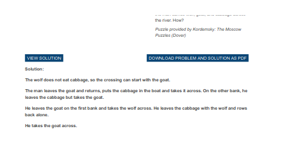
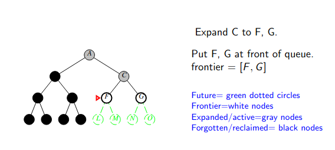

# Lecture 3 - Problem Solving as Search | Uninformed Search
## Problem solving and search
* Some problems have straightforward soltions
  * Solve by applying a formula, or a well-known procedure.
  * Example: differential equations
* Other problems require search:
  * no single standardized method
  * alternatives need to be exlored to solve the problem
  * the number of alternatives to search among can be very large, even infinite.
## Example: Cabbage, goat, wolf and farmer


How many river crossings does the farmer need? 4, 5, 6, 7, or no solution?
How did you think to solve the problem?
## Cabbage, goat, wolf, and the farmer

## Cabbage, goad, wolf and farmer - an answer

* The important thing is not how you solved this manually
* Important is how we can make the machine to solve such problems automatically
* What kind of systemical approach in order to considers possibilities?
* Search is a suitable method to do this
## Example: solving 8-puzzle


What is a __state__?
## Example: 8-puzzle


Search is about exploring alternatives.
## Problem-solving agents
A type of goal-based agent.
```
function SIMPLE-PROBLEM-SOLVING-AGENT(percept) returns an action
    static: seq, an action sequence, initially empty
            state, some description of the current world state
            goal, a goal, initially null
            problem, a problem formulation
    
    state <-- UPDATE-STATE(state, percept)
    if seq is empty then
        goal <-- FORMULATE-GOAL(state)
        problem <-- FORMULATE-PROBLEM(state, goal)
        seq <-- SEARCH(problem)
    action <-- FIRST(seq, state)
    seq <-- REST(seq, state)
    return action
```
## Problem formulation


A _problem_ is defined by:
  * initial state: e.g., "at Arad"
  * actions: e.g., Go(Sibiu)
  * transition model: defines what each action does. e.g., {In(Arad), Go(Sibiu), In(Sibiu)}
  * goal test
  * path cost: e.g., sum of distances, number of actions executed, etc. $c(x,a,y)$ is the _step cost_, assumed to be nonnegative.

A _solution_ is a sequence of actions leading from the initial state to a goal state.
## Goal formulation
Goal may be
* explicit, e.g., 8-puzzle
* implicit, e.g., "no dirt"; through a condition as in sudoku: underdefined $8$-puzzle (figure below) where "any" means any except 8, 3, 1


## Solution
* A solution is a sequence of actions that connect the initial state to a goal state.
* Sometimes no solutions exists


## State Space


__A state:__ the agent location and the dirt locations
__State Space:__ All the possible states and the links/relationship (in terms of actions) between them  
* How many states in this state space?
* The agent can be in one of the $2$ locations, and each location may/not have dirt, so $2\times2^2$ possible states.
* For an $n$-location environment, the state space has $n\times2^n$ states
## State space - Romania example


On holday in Romania; currently in Arad.
Flight leaces tomorrow from Bucharest

* __Formulate goal:__ be in Bucharest
* __Formulate problem:__
  * __states:__ various cities
  * __actions:__ drive between cities
* __Find solution:__ sequences of cities, e.g., Arad, Sibiu, Fagaras, Bucharest
## Example: Vauum world state space graph

* __States:__ integer dirt and robot locations (ignore dirt _amounts_ etc.)
* __Actions:__ Left, Right, Suck, NoOp
* __Goal test:__ no dirt
* __Path cost:__ 1 per action (0 for NoOP)
## Example 8-puzzle

* __States:__ integer locations of tiles (ignore intermediate positions)
* __Actions:__ move blank left, right, up, down (ignore unjamming etc.)
* __Goal test:__ goal state (given)
* __Path cost:__ 1 per move

[Note: optimal solution of $n$-Puzzle is NP-hard]
## Example: robotic assembly

* __States:__
  * real-valued coordinates of robot joint angles
  * parts of the object to be assembled
* __Actions:__ continious motions of robot joints
* __Goal test:__ complete assembly
* __Path cost:__ time to execute
## State Space Graph and Search Tree


* A _state_ is a (representation of) a physical configuration
* A _node_ is a data structure consistuting part of a search tree
  * includes parent, children, depth, path cost $g(x)$
* Sates do not have parents, children, depth, or path cost!
## State graph is incrementally explored
* Most of the time it is not feasible or too expensive to build and represent the entire state graph. The problem solver agent (i.e., AI) generates a solution by __incrementally exploring__ a small portion of the graph.
## Implementation: general tree search
Basic idea: simulated exploration of state space by generating successors of already-explored states

```
function TREE-SEARCH(problem, frontier) returns a solution, or failure

  Initialize the frontier using the initial state of the problem
  loop do
    if frontier is empty then return failure
    choose a leaf node and remove it from the frontier
    if the node contains a goal state then return the correspond solution
    expand the chosen node, adding the resulting nodes to the frontier
  end
```
## Graph search
Checks the repetition of nodes.

```
function GRAPH-SEARCH(problem, frontier) returns a solution, or failure

  Initialize the frontier using the initial state of the problem
  Initialize the explored set to be empty
  loop do
    if frontier is empty then return failure
    choose a leaf node and remove it from the frontier
    if the node contains a goal state then return the correspond solution
    add the node to the explored set
    expand the chosen node, adding the resulting nodes to the frontier
      only if not in the frontier or explored
  end
```
## Search strategies
A strategy is defined by picking the _order of node expansion_

Strategies are evaluated along the following dimensions:
  * _completeness_ - does it always find a solution if one exists?
  * _time complexity_ - number of nodes generated/expanded
  * _space complexity_ - maximum number of nodes in memory
  * _optimality_ - does it always find a least-cost solution?

Time and space complexity are measured in terms of
  * $b$ - maximum branching factor of the search tree
  * $d$ - depth of the least-cost solution
  * $m$ - maximum depth of the state space (may be $\infty$)
## Examples on Uninformed Search Strategies
Different "search strategies" explore the possibilites in different order


## Uninformed search strategies
_Uninformed_ strategies use only the information in the problem definition
* Breadth-first search
* Uniform-cost search
* Depth-first search
* Depth-limited search
* Iterative deepening search
## Breadth-first search
Idea: explore the search space "horizontally", i.e. expanding all nodes at level $k$ before taking into account nodes at level $k+1$

Implementation: The intended behavior can be ensured by using a FIFO policy for storing to be expanded nodes.
## Breadth-first search on a graph
```
function BREADTH-FIRST-SEARCH(problem) returns a solution, or failure

  node <-- a node with STATE = problem.INITIAL-STATE, PATH-COST = 0
  if problem.GOAL-TEST(node.STATE) then return SOLUTION(node)
  frontier <-- a FIFO queue with node as the only element
  explored <-- an empty set
  loop do
    if EMPTY?(frontier) then return failure
    node <-- POP(frontier) /* chooses the shallowest node in frontier */
    add node.STATE to explored
    for each action in problem ACTIONS(node.STATE) do
      child <-- CHILD-NODE(problem,node,action)
      if child.STATE is not in explored or frontier then
        if problem.GOAL-TEST(child.STATE) then return SOLUTION(child)
        frontier <-- INSERT(child,frontier)
```
### Breadth-first search
Expand shallowest unexpanded node
__Implementation:__
* _fringe_ is a FIFO queue, i.e., new successors go at end


## Properties of breadth-first search
* __Complete:__ Yes (if $b$ is finite)
* __Time:__ $1+b+b^2+b^3+\dots+b^d=O(b^d),$ i.e., exp. in $d$
* __Space:__ $O(b^d)$ (keeps every node in memory)
* __Optimal:__ Yes (if path cost is nondecreasing with depth, e.g., all actions have the same cost); not optimal in general.
  
__Space__ is the big problem; can generate nodes at 1000MB/sec so 24hrs = 86400GB.
## Uniform-cost search
An algorithm optimal with varying positive step costs.

```
function UNIFORM-COST-SEARCH(problem) returns a solution, or failure

  node <-- a node with STATE=problem.INITIAL-STATE, PATH-COST=0
  frontier <-- a priority queue ordered by PATH-COST, with node as the only element
  explored <-- an empty set
  loop do
    if EMTPY?(frontier) then return failure
    node <-- POP(frontier) /* chooses the lowest-cost node in frontier */
    if problem-GOAL-TEST(node.STATE) then return SOLUTION(node)
    add node.STATE to explored
    for each action in problem.ACTIONS(node.STATE) do
      child <-- CHILD-NODE(problem,node,action)
      if child.STATE is not in exlored or frontier then
        frontier <-- INSERT(child,frontier)
      else if child.STATE is in frontier with higher PATH-COST then
        replace that frontier node with child
```

Expand least-cost unexpanded node
__Implementation:__
* _fringe_ = queue ordered by path cost, lowest first

Equivalent to breadth-first if step costs all equal
* __Complete:__ Yes, if step cost $\geq\epsilon$
* __Time:__ # of nodes with $g\leq$ cost of optimal solution, $O\left(b^{1+[C*/\epsilon]}\right)$ where $C*$ is the cost of the optimal solution
* __Space:__ # of nodes with $g\leq$ cost of optimal solution, $O\left(b^{1+[C*/\epsilon]}\right)$
* __Optimal:__ Yes - nodes expanded in increasing order of $g(n)$
## Depth-first search
Expand deepest unexpanded node
__Implementation:__
* _fringe_ = LIFO queue, i.e., put successors at front





## Properties of depth-first search
* __Complete:__ No: tree search fails in infinite-depth spaces, e.g., spaces with loops
  * Modify to avoid repeated states along path. Check if current nodes occured before on path to root. No extra memory cost but it avoids infinite loops, not redundant paths.
  * Can use graph search (remember all nodes ever seen). It is complete in finite spaces. Problem with graph search: space is exponential, not linear. Still fails in infinite-depth spaces (may miss goal).
  * $\implies$ complete in finite spaces
* __Time:__ $O(b^m):$ terrible if $m$ is much larger than $d$ but if solutions are dense, may be much faster than breadth-first
* __Space:__ $O(bm),$ i.e., linear space!
* __Optimal:__ No
## DFS

## Depth-limited search
= depth-first search with depth limt $l$, i.e., nodes at depth $l$ have no successors

__Recursive implementaiton:__
```
function DEPTH-LIMITED-SEARCH(problem, limit) returns soln/fail/cutoff
  RECURSIVE-DLS(MAKE-NODE(INITIAL-STATE[problem]), problem, limit)

function RECURSIVE-DLS(node,problem,limit) returns soln/fail/cutoff
  cutoff-occurred? <-- false
  if GOAL-TEST(problem,STATE[node]) then return node
  else if DEPTH[node] == limit then return cutoff
  else for each successor in EXPAND(node,problem) do
    result <-- RECURSIVE-DLS(successor,problem,limit)
    if result == cutoff then cutoff-occurred? <-- true
    else if result != failure then return result
  if cutoff-occurred? then return cutoff else return failure
```
## Iterative deepening search
```
function ITERATIVE-DEEPENING-SEARCH(problem) returns a solution
  inputs: problem, a problem

  for depth <-- 0 to infinity do
    result <-- DEPTH-LIMITED-SEARCH(problem, depth)
    if result != cutoff then return result
  end
```
## Iterative deepening search with $l=0$

## Iterative deepening search with $l=1$

## Iterative deepening search with $l=2$

## Iterative deepening search with $l=3$

## Properties of iterative deepening search
* __Complete:__ Yes
* __Time:__ $(d+1)b^0+db^1+(d-1)b^2+\dots+b^d=O(b^d)$
* __Space:__ $O(bd)$
* __Optimal:__ Yes, if step cost are equal
## Uninformed vs informed search

* For an uninformed search strategy, states S1 and S2 are two indifferent nodes (e.g., at the same level in the search tree)
* Uninformed search strategies uses only the position of the nodes in the tree, not the state descriptions
* S1 is more promising than S2 for an informed (heuristic) search strategy that counts the number of misplaced tiles
* Heuristic strategies use the information in the state description
## Summary of tree-search algorithms


* *a) breadth-first complete if $b$ is finite
* *b) uniform-cost complete if step cost is $\geq\epsilon>0$
* *c) optimal if step costs are equal. Also if path cost non-decreasing fn. of depth.
