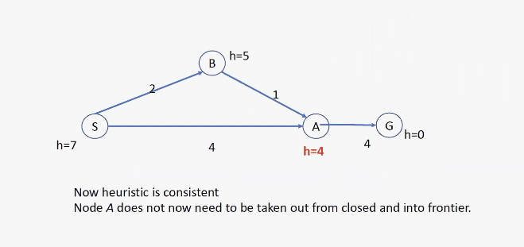
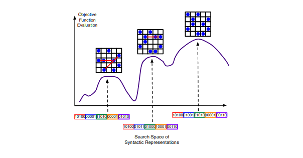

# Lecture 4 - Informed search and Local search
## Recap
* Problem solving through searching in a solution space
* The basis:

```
funciton TREE-SEARCH(problem,frontier) returns a solution, or failure

    Initialize the frontier using the initial state of the problem
    loop do
        if frontier is empty then return failure
        choose a leaf node and remove it from the frontier
        if the node contains a goal state then return node the corresponding solution
        expand the chosen node, adding the nodes to the frontier
    end
```
* A strategy is defined by picking the __order of node exploration__
## Uninformed Search disadvantageous
* Last week: Uninformed search
* Uninformed search, systematically searching the search space blindly - not questioning where the goal may be in the space
* Search space is often very large. Time/space problems with such exhaustive search - think of chess
* In such situations, better to use algorithms which does a more informed search
## Heuristic
Informed Search algorithms used "heuristics".
What is a heuristic?


## Heuristic - example


## Heuristic Search Algorithms
Today we look at two well-known informed search algorithms:
* Greedy Best First search
* A*
## Best-first search
* __Idea:__ use an __evaluation function__ for each node
  * estimate of "desirability"
* $\implies$ Expand most desirable unexpanded node
* __Implementation:__
  * _frontier_ is a queue sorted in decreasing order of desirability
* Special cases:
  * Greedy search
  * A* search
## Greedy search
* Evaluation funcion = $h(n)$ (<b>h</b>euristic)
  * estimate the cost from $n$ to the closest goal
* E.g., $h_{SLD}(n)=$ straight-line distance from $n$ to Bucharest
* Gready search expands the nodes that __appears__ to be closest to goal
## Greedy Search, Romania Example

## Greedy search for Romania example

## Greedy search example


## Properties of greedy search

* __Complete:__ 
  * No for tree search - can get stuck in loops, e.g., assume getting from Iasi to Fagaras. 
  * Straight line distance-wise, Neamt is closest to Fagaras. Hence, Iasi $\rightarrow$ Neamt $\rightarrow$ Iasi $\rightarrow$ Neamt $\rightarrow\dots$
  * Complete in graph version (i.e., with repeated-state checking) for finite spaces
* __Time:__ $O(b^m)$, but a good heuristic can give dramatic improvement
* __Space:__ $O(b^m)$ - keeps all nodes in memory
* __Optimal:__ No. E.g., the path it found (Sibiu-Fagaras-Bucharest) is longer than the path Sibiu-Rimnicu-Vilcea-Pitesti-Bucharest
## A* search
__Idea:__ avoid expanding paths that are already expensive

Evaluation function
$$f(n)=g(n)+h(n)$$
$g(n)=$ cost so far to reach $n$
$h(n)=$ estimated cost of the cheapest path from $n$ to goal node
$f(n)=$ estimated cost of the cheapest solution through $n$ to goal
## A* search example


## Properties of A*
* __Complete:__
  * Yes, unless there are infinitely many nodes with $f\leq f(G).$
  * I.e., if all step costs are $>\epsilon$ and $b$ is finite.
* __Time:__ Exponential in [relative error in $h\times$ length of solution.]
* __Space:__ Main drawback. Keeps all nodes in memory
* __Optimal:__ Yes - cannot expand $f_{i+1}$ until $f_i$ is finished

A* expands all nodes with $f(n)<C*$ (where $C*$ is the cost of optimal solution path)
A* expands some nodes with $f(n)=C*$
A* expands no nodes with $f(n)>C*$
## Optimality of A*
A* optimal if
* the branching factor is finite
* arc costs are strictly positive
* for tree search: $h$ is admissible and is non-negative
* for graph search: $h$ is consistent (monotonic) and non-negative

__Admissible:__ Does not overestimate the cost from node $n$ to the goal node (Also require $h(n)\geq0,$ so $h(G)=0$ for any goal $G.$)

__Lemma:__ A* expands nodes in order of increasing $f$ value

Gradually adds "$f$-contours" of nodes (cf. breadth-first adds layers). Contour $i$ has all nodes with $f=f_i,$ where $f_i<f_{i+1}$


Suppose some suboptimal goal $G_2$ has been generated and is in the queue. Let $n$ be an unexpanded node on a shortest (least cost) path to an optimal goal $G.$
We want to prove: $f(n)<f(G_2)$ - (then A* will prefer $n$ over $G_2$)


## Example - Admissibility-Optimality

## A* is optimally efficient
Optimal Efficiency: No other algorithm using the same heuristic information is guaranteed to expand fewer nodes than A* - expcept it may be unlucky about how it breaks ties between nodes with $f(n)<C*.$

This is because any algorithm that does not expand all nodes with $f(n)<C*$ has the risk of missing the optimal solution.
## Consistency
A heuristic is __consistent__ / __monotonous__ if


If $h$ is consistent, we have
$$\begin{aligned}
f(n')&=g(n')+h(n')\\
&=g(n)+c(n,a,n')+h(n')\\
&\geq g(n)+h(n)\\
&\geq f(n)
\end{aligned}$$
I.e., $f(n)$ is nondecreasing along any path.
## A* graph search algorithm - pseudocode
Assumption: heuristic is consistent (hence admissible)
__Theorem:__ If $h(n)$ is consistent, A* Graph Search is optimal
```
Start.g = 0;
Start.h = heuristc(Start);
FRONTIER = {Start}
CLOSED = {empty set}
WHILE FRONTIER is not empty
  N = FRONTIER.popLowestF()
  IF state of N = GOAL RETURN N
  add N to CLOSED
  FOR all children M of N not in CLOSED:
    M.parent = N
    M.g = N.g + cost(N,M)
    M.h = heuristic(M)
    add M to FRONTIER
  ENDFOR
ENDWHILE
```
Does not re-expand nodes in CLOSED.
Would it find the optimal solution?
## Example - More on A* graph search

* When a new node $N$ is generated:
  * If $N$ is in _Closed_ then discard $N$
  * If $N$ is already in frontier, then keep $N$ with least $f$ value.
## Example cont. Graph with consistent heuristic

* When a new node $N$ is generated:
  * If $N$ is in _Closed_ then discard $N$
  * If $N$ is already in frontier, then keep $N$ with least $f$ value.
## Admissible heuristics
E.g., for the $8$-puzzle:

Goal state is: Upper left tile is empty, in the rest of the frid: numbers 1-8 are in natural order (example from the book).

$h_1(n)=$ number of misplaced tiles
$h_2(n)=$ total Manhattan distance (i.e., no. of squares from desired location of each tile)


## Dominance
If $h_2(n)\geq h_1(n)$ for all $n$ (both admissible) then $h_2$ dominates $h_1$ and is better for search

Typical search costs:


Given any admissible heuristics $h_a,h_b,$
$$h(n)=max(h_a(n),h_b(n))$$
is also admissible and dominates $h_a,h_b$
## Relaxed problems
Admissible heuristics can be derived from the __exact__ solution cost of a __relaxed__ version of the problem

If the rules of the 8-puzzle are relaxed to that a tile can move __anywhere__, then $h_1(n)$ gives the shortest solution.

If the rules are relaxed to that a tile can move to any __any adjacent square,__ then $h_2(n)$ gives the shortest solution

Key point: the optimal solution cost of a relaxed problem is no greater than the optimal solution cost of the real problem
## Local Search
In many optimization problems, __path__ is irrelevant; the goal state itself is the solution

Then state space = set of "complete" configurations;
find __optimal__ configuration, e.g., TSP
or, find configuration satisfying constraints, e.g., timetable

In such cases, can use iterative improvement algorithms;
keep a single "current" state, try to improve it

Constant space, suitable for online as well as offline search
## Incremental versus Local Search

## Properties of Local Search
* Low space complexity - only need to save one (or a set) of current solutions, NOT paths back to the start state.
* Time complexity varies, though recent work indicates major improvements over incremental search for problems with densely-packed optimal solutions.
* Satisficing - can often find _reasonably good_ solutions quickly.
* Requires representations that are easy to _tweak_ to generate search-space neighbors.
* Uses an __objective function__ to evaluate solutions. Similar to a heuristic but for complete solutions $\rightarrow$ less guesswork.
* Often portrayed as movement in a __landscape.__
## Example: Travelling Salesperson Problem
Find the shortest (least cost) tour that visits each city and returns to the start-city, i.e., Eval(Solution) is minimum.


Start with any complete tour, perform (action) pairwise exchanges


Variants of this approach get within 1% op optimnal very quicklu with thousands of cities
## Example: $n$-queens
Put $n$ queens on an $n\times n$ board with no two queens on the same row, column, or diagonal

Move a queen (on the same column) to reduce the number of conflicts


Almost always colves $n$-queens problems almost instantaneously for very large $n,$ e.g., $n=1$ million
## Egg Carton Problem
Put as many eggs as possible into the $M\times N$ carton, but never have more than $K$ eggs along any horizontal, vertical or diagonal line. Typically, $K=2.$


## Representations, Translation and Evaluation

## State-space Landscape
Useful to consider __state space landscape__


## Search Landscape

__Critical-Design Decisions__
* Objective function defines the landscape.
* Representation-modifying operators define legal moves in landscape.
## Hill-climbing (or gradient ascent/descent)
```
function HILL-CLIMBING(problem) returns a state that is a local maximum
  inputs: problem, a problem
  local variables: current, a node
                   neighbour, a node

  current <-- MAKE-NODE(INITIAL-STATE[problem])
  loop do
    neighbour <-- a highest valued successor of current
    if VALUE[neighbour] <= VALUE[current] then return STATE[current]
    current <-- neighbour
  end
```
VALUE may be the value of objective function (ascending, here) or heuristic cost (descending).
## Hill-Climbing - 8-puzzle


Heuristic cost $h=17$ for the state on the left, and $h=1$ for the state on the right.
$h=$ number of paris of queens attacking each other.
## Hill-climbing -cont.
"Like climbing Everest in thick fog with amnesia."


## Hill-Climbing

__Properties__
* Greedy: always moves to states with immediate benefits, (i.e., $\uparrow$ evals).
* Quick on smooth landscapes.
* Easily gets stuck on rough landscapes (e.g., the 8-puzzle state with $h=1$ in the previous slides.)
## Simulated Annealing (SA)

__Properties__
* Hill-climbing with _jiggle._
* SA's __temperature__ parameter regulates amount of jiggle: high early in search, then gradually decreasing.
* Jiggle allows traversal of chasms and plateaus.
## Simulated Annealing
Idea: escape local maxima by allowing some "bad" moves
__but gradually decrease their size and frequency__
```
function SIMULATED-ANNEALING(problem,schedule) returns a solution state
  inputs: problem, a problem
          schedule, a mapping from time to "temperature"
  local variables: current, a node
                   next, a node
                   T, a "temperature" controlling prob. of downward steps
  
  current <-- MAKE-NODE(INITIAL-STATE[problem])
  for t <-- 1 to infinity do
    T <-- schedule[t]
    if T == 0 then return current
    next <-- a randomly selected successor of current
    Delta E <-- VALUE[next] - VALUE[current]
    if Delta E > 0 then current <-- next
    else current <-- next only with probability e^{Delta E / T}
```
## Local beam search
__Idea:__ keep $k$ states instead of $1;$ choose top $k$ of all their successors

Not the same as $k$ searches run in parallel!
Searches that find good states recruit other searches to join them

__Problem:__ quite often, all $k$ states end up on same local hill

__Idea:__ choose $k$ successors randomly, biased towards good ones

Observe the close analogy to natural selection!
## Genetic algorithms
* A successor state is generated by combining two parent states
* Start with $k$ randomly generated states (population)
* A state is reprsented as a string over a finite alphabet (often a string of 0s and 1s)
* Evaluation function (fitness function). Higher values for better states.
* Produce the next generation of states by selection, crossover, and mutation

Example: 8-queens


Fitness function (i.e., objective fn): number of non-attacking pairs
Selection: Probability of being regenerated in the next generation
## Genetic algorithms contd.
GAs require states encoded as strings (GPs use programs)

Crossover helps __iff substrings are meaningful components__


## Summary
