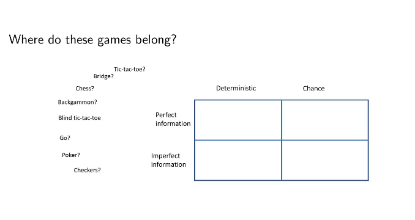

# Lecture 5: Adversarial Search
## Adversarial Search
* Adversiarial search problems are searches in multiagent environments.
* The agent needs to consider:
  * The possible actions of other agents
  * How these actions can affect its own welfare.
## Single agent vs. multiagent environments
* Agents may interact
  * compete
  * collaborate
* AI game theory is often concerned with a specific subset of games:
  * __Deterministic__ - Outcome of any action is certain and consistent.
  * __Turn-taking__ - Each player takes one turn each per round
  * __Two-player__ - Only two players involved...
  * __Zero-sum__ - The total losses and gains of both agents sums to zero.
  * __Perfect information__ - All participants have full knowledge about their cost and utility functions and game history.



## Example: Nim
* Game rule: there are $x$ number of objects - e.g., fruits - and each player picks up and eats either one or $2$ fruits on their turn. The player that eats the last one wins.
* Perfect information, 2-player, Deterministic, Zero-sum, Turn-taking.
* We can represent the game as a tree and do search


## Example: Tic-tac-toe

Problem/question: What is the best strategy to win?
In tic-tac-toe when both players play optimally, neither player will win.
## Games vs. search problems
* We call the two players: MAX and MIN
* MAX wants to reach a state with maxmimum value
* MIN wants to reach a state with minimum value
* The player we want to win starts the game (MAX)
## The Game Tree
* In games the search tree is a tree where at each alternating level one of the players has the control/decisions.
* One move involves a decision from each player. Each player decision is called a ply.
* Each leaf in the search tree is assigned a utility value - often:
  * +1 = win
  * -1 = lose
  * 0 = draw
* We assume that the opponent is "unpredictable" $\implies$ __solution__ is a __strategy__ specifying a move for every possbile opponent reply.
## Let's define the optimal game strategy!
The optimal strategy is one that leads to outcomes __at least as good__ as any other strategy when playing an __infallible__ opponent.
## The minimax value
The MiniMax value of a node (MINIMAX$(n)$) is the __utility__ for MAX of being in the corresponding state, assuming that both players optimally from there on to the end of the game.
* In __terminal states__ the minimax value is just the utility of that state.
* If given a choice, MAX will always move to a state with maximum value.
* MIN will always move to a state with minimum value.
$$\text{MINIMAX}(n)=\begin{cases}
\text{UTILITY}&\quad\text{if TERMINAL-TEST}(s)\\
max_{a\in\text{Actions}(s)}{\text{MINIMAX}(s,a)}&\quad\text{if PLAYER}(s)=\text{MAX}\\
min_{a\in\text{Actions}(s)}{\text{MINIMAX}(s,a)}&\quad\text{if PLAYER}(s)=\text{MIN}
\end{cases}\tag{1}$$
## Minimax adversarial search algorithm

## Basis Process of Adversarial Search
* From the start state, generate a search tree in a depth-first manner, alternating between own (computer) and opponent's possible moves.
* Only use heuristics/eval functions to evaluate the promise of the bottom-level nodes; then propagate values upwards, combining them using MAX and MIN operators.
* Return to the root and choose the action $A_\text{best},$ leading to the highest-rated child state, $S_\text{best}.$
* Apply $A_\text{best}$ to the current game state, producing $S_\text{best}$. Wait for the opponent to choose an action, which then produces the new game state, $S_\text{new}.$
* Now from $S_\text{new}$ node choose and apply the action that leads to the highest-rated child state.
## Minimax algorithm
Adversarial analogue of DFS
```
function MINIMAX-DECISION(state) returns an action
    inputs: state, current state in game

    return the a in ACTIONS(state) maximizing MIN-VALUE(RESULT(a, state))
```
```
function MAX-VALUE(state) returns a utility value
    if TERMINAL-TEST(state) then return UTILITY(state)
    v <-- negative infinity
    for a, s in SUCCESSORS(state) do v <-- MAX(v, MIN-VALUE(s))
    return v
```
```
function MIN-VALUE(state) returns a utility value
    if TERMINAL-TEST(state) then return UTILITY(state)
    v <-- positive infinity
    for a, s in SUCCESSORS(state) do v <-- MIN(v, MAX-VALUE(s))
    return v
```
## Minimax example

## Properties of minimax
* __Complete:__ Only if tree is finite
* __Optimal:__ Yes, against an optimal opponent,
* __Time complexity:__ $O(b^m)$
* __Space complexity:__ $O(bm)$ (depth-first exploration)

For chess, $b\approx35,m\approx100$ for "reasonable" games
$\implies$ exact solution completely infeasible

But do we need to explore every path?
## Alpha-Beta Pruning

## Alpha and Beta
__Alpha__
* A modifiable property of a MAX node.
* Indicates the lower bound on the evaluation of that MAX node.
* Updated whenever a LARGER evaluation is returned from a child MIN node.
* Used for pruning at MIN nodes.

__Beta__
* A modifiable property of a MIN node.
* Indicates the upper bound on the evaluation of that MIN node.
* Updated whenever a SMALLER evaluation is returned from a child MAX node.
* Used for pruning at MAX nodes.

Both alpha and beta are passed between MIN and MAX nodes.
## The $\alpha$-$\beta$ algorithm
```
function ALPHA-BETA-SEARCH(state) returns an action
    v <-- MAX-VALUE(state, negative infinity, positive infinity)
    return the action a in ACTIONS(state) with value v
```
```
function MAX-VALUE(state, alpha, beta) returns a utility value
    inputs: state, current state in game
            alpha, the value of the best alternative for MAX along the path to state
            beta, the value of the best alternative for MIN along the path to state
    
    if TERMINAL-TEST(state) then return UTILITY(state)
    v <-- negative infinity
    for each a in ACTIONS(state) do
        v <-- MAX(v, MIN-VALUE(s, alpha, beta))
        if v >= beta then return v
        alpha <-- max(alpha, v)
    return v
```
```
function MIN-VALUE(state, alpha, beta) returns a utility value
    inputs: state, current state in game
            alpha, the value of the best alternative for MAX along the path to state
            beta, the value of the best alternative for MIN along the path to state
    
    if TERMINAL-TEST(state) then return UTILITY(state)
    v <-- positive infinity
    for each a in ACTIONS(state) do
        v <-- MIN(v, MIN-VALUE(s, alpha, beta))
        if v <= alpha then return v
        beta <-- min(beta, v)
    return v
```
## A moment in MAX node's life

## A moment in MIN node's life

## $\alpha$-$\beta$ pruning example

## Properties of $\alpha$-$\beta$
* Pruning __does not__ affect final result
* Good move ordering improves effectiveness of pruning
* Which nodes can be pruned in the following example:


With "perfect ordering," time complexity = $O(b^{m/2})$
$\implies$ __doubles__ solvable depth

A simple example of the value of reasoning about which computations are relevant (a form of __metareasoning__)

Unfortunately, $35^{50}$ (e.g., chess) is still impossible!
## Resource limits
Standatd approach:
* Use CUTOFF-TEST instead of TERMINAL-TEST
  * e.g, depth limit
* Use EVAL instead of UTILITY
  * i.e., a heuristic evaluation function that estimates desirability of position
## Evaluation Functions
A evaluation function returns an estimate of the expected utility of the game in a given position. An inaccurate evaluation function can guide agent into horrible states.

Properties of a good evaluation function:
* It should order terminal states the same way as the true utility function.
* Computation must not take too long (that's the whole point remember).
* For non-terminal states, the evaluation function should be strongly correlated with the true chance of winning.


For chess, typically linear weighed sum of features

$$\text{Eval}(s)=w_1f_1(s)+w_2f_2(s)+\dots+w_nf_n(s)$$

e.g., $w_1=9$ with
$$f_1(s)=\text{(number of white queens)}-\text{(number of black queens)},\quad\text{etc.}$$
## Digression: Exact values don't matter


Behaviour is preserved under any __monotonic__ transformation of EVAL
## Deterministic games in practise
* __Checkers:__ Chinook ended 40-year-reign of human world champion Marion Tinsley in 1994. Used an endgame database defining perfect play for all positions involving 8 or fewer pieces on board, a total of $443,748,401,247$ positions.
* __Chess:__ Deep Blue defeated human world champion Gary Kasparov in a six-game match in 1997. Deep Blue searches 200 million positions per second, uses very sophisticated evaluation, and undisclosed methods for extending some lines of search up to 40 ply.
* __Othello:__ human champions refuse to compete ageaint computers, who are too good.
* __Go ($b>300$):__ human champions refused to compete against computers, who were too bad - until 2015. In 2017 Future of Go Summit, AlphaGo beat Ke Jie, the world No. 1 ranked player at the time.
## Stochastic (nondeterministic) games
In stochastic games, chance introduced by dice, card-shuffling etc.
We use chance nodes to represent chance in stochastic games:
* Each branch represents a possible outcome (6 branches for a dice).
* Branches are labelled with the associated probability (1/6 for dice).
## Stochastic games in general
Simplified example with coin-flipping:


## Algorithms for nondeterministic games
EXPECTIMINIMAX gives perfect play.
Just like MINIMAX, except we must also handle chance nodes:
```
...
if state is a MAX node then
    return the highest EXPECTIMINIMAX-VALUE of SUCCESSORS(state)
if state is a MIN node then
    return the lowest EXPECTIMINIMAX-VALUE of SUCCESSORS(state)
if state is a chance node then
    return sum of ... EXPECTIMINIMAX-VALUE of SUCCESSORS(state)
alternative: ...
```
## Digression: Exact values DO matter


EVAL should be proportional to the expected payoff.
## Summary
Games are fun to work on! (and dangerous)

They illustrate several important points about AI
* perfection is unattainable $\implies$ must approximate
* good idea to think about what to think about
* uncertaintiy constraints the assignment of values to states

Games are to AI as grand prix racing is to automobile design.