# Lecture 6: Constraint Satisfaction Problems
## What is a constraint satisfaction problem
__Example:__ $N$-queen problem


Place $N$ queens on an $N\times N$ chess board with the constraint that they don't attack each other.
## 8-queen problem
Solution to the 8-queen problem?

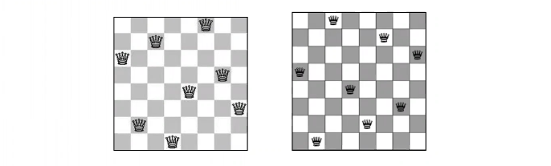

There are $92$ different solutions.
## How would you solve the $N$-queen problem?
Humans solve this problem
* by experimenting with different configurations.
* using various insights about the problem to explore only a small number of configurations before they find an answer.
* However, it would be hard for humans to solve a $1000$ Queen problem!

We need computer-specific methods for solving such a problem.
## Method: Try every configuration systematically?


Although computers are good at trying many small things quickly
* for the 4-quuen problem there are 256 configurations
* 16,777,216 configurations for $8$-queen problem, and
* ...
* there are $N^N$ configurations for $N$-Queens.
* still too much time for the modern machines.
## Good news
* We notice that in, e.g., the $4$-Queens problem, as soon as we place some of the queens we know that an entire addtional set of configurations are invalid.
* This is the rationale behind the methods for solving CS problems.
* $N$-queen problem is an instance of a generic problem class and we want to design algorithms that solve this type of problems.


## Example: Map-Coloring
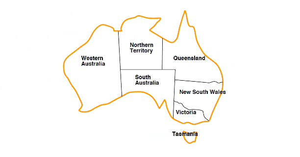

__Task/problem:__ colour this map using $3$ colours with the __constraint:__ adjacent regions must have different colours.
## CSP in real-world
* Assignment problems
  * e.g., who teaches what class
* Timetabling problems
  * e.g., which class is offered when and where?
* Hardware configuration
* Transportation scheduling
* Factory scheduling
* etc.
## CSP definition, components
* A Constraint Satisfaction Problem (CSP) is defined through $3$ components:
  * A set of __variables__
  * A set of __values__
  * A set of __constraint__ between variables
* A CSP solving algorithm should assign a value to each variable that satisfies all the constraints.
## Example: Map-Coloring


* Variables: $\{WA,NT,Q,NSW,V,SA,T\}$
* Domain: {red, green, blue}
* Constraints: adjacent regions must have different colors, e.g., $WA\ne NT$ (if the language allows this), or
$$(WA,NT)\in\{(red,green),(red,blue),(green,red),(green,blue),\dots\}$$
## Varieties of constraints
* Unary constraints involve a single variable,
  * e.g., $SA\ne green$
* Binary constraints involve pairs of variables,
  * e.g., $SA\ne WA$
* Higher-order constraints involve $3$ or more variables,
  * e.g., Sudoku
* Preferences (soft constraints), e.g., red is better than green often representable by a cost for each variable assignment
  * $\rightarrow$ constrained optimization problems
## What is a Solution?
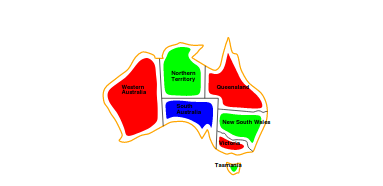

__Solutions__ are assignments satisfying all constraints, e.g.,

$$\{WA=red,NT=green,Q=red,\\NSW=green,V=red,SA=blue,T=green\}$$
## Visualization of CSP - Constraint graph
__Constraint graph:__ nodes are variables, arcs shows constraints, e.g., in the following figure: WA and NT cannot take the same value.

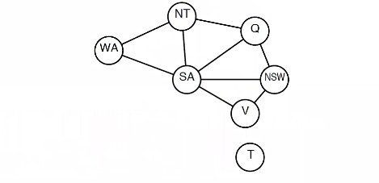

__Basic problem:__ Find a $d_i\in D$ for each variable $V_i$ such that all constraints are satisfied, i.e., find consistent values for variables.
## Approaches to Solving CSPs
* Incremental Search - Backtracking
* Inference, e.g., Forward Checking, Arc consistency
* Backtracking with inference, e.g., with Forward Checking
* Local Search
## CSP as a Standard Search problem
States are defined by the values assignes so far
* __Initial state:__ the empty assignment, $\{\}$
* __Successor function:__ assign a value to an unassigned variable that does not conflict with current assignment.
  * $\implies$ fail if no legal assignments (not fixable!)
* __intermediate states:__ partial assignment of variables
* __Goal test:__ the current assignment is complete and consistent
## Backtracking search
* Variable assignments are __commutative__, i.e.,
  * [$WA=red$ then $NT=green$] same as [$NT=green$ then $WA=red$]
* Backtracking employs __Depth-first search__ for CSPs with single-variable assignments
* Backtracking search is the basic uninformed algorithm for CSPs
* Only need to consider assignments to a single variable at each node
  * $\implies b=d$ and there are $d^n$ leaves

Can solve $n$-queens for $n\approx25$
```
function BACKTRACKING-SEARCH(csp) returns solution/failure
    return RECURSIVE-BACKTRACKING({}, csp)

function RECURSIVE-BACKTRACKING(assignment, csp) returns soln/failure
    if assignment is complete then return assignment
    var <-- SELECT-UNASSIGNED-VARIABLE(VARIABLES[csp], assignment, csp)
    for each value in ORDER-DOMAIN-VALUE(var, assignment, csp) do
        if value is consistent with assignment given CONSTRAINTS[csp] then
            add {var = value} to assignment
            result <-- RECURSIVE-BACKTRACKING(assignment, csp)
            if result != failure then return result
            remove {var = value} from assignment
    return failure
```
## Example - Backtracking
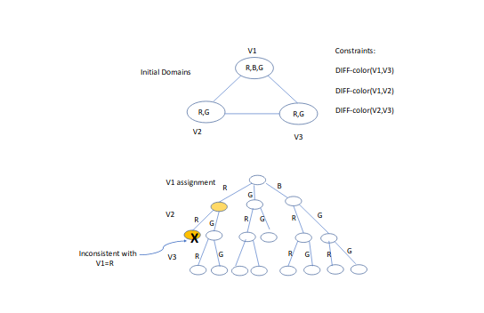
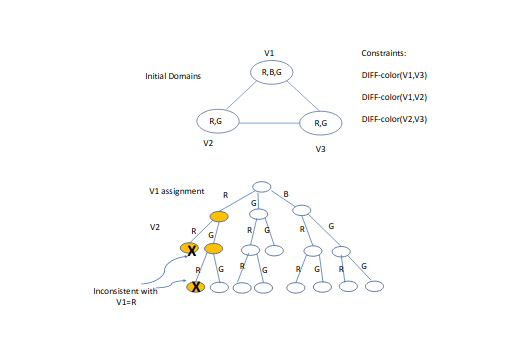
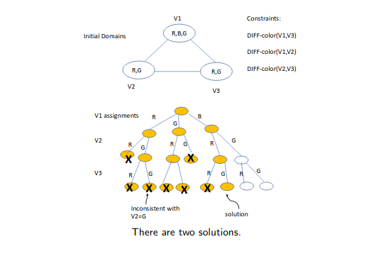
## Improving backtracking efficiency by Heuristics
* Previously we talked about heuristics for improvement of uninformed search
* This time heuristics are NOT domain-specific though
* For CSP, general-purpose methods can give huge gains in speed:
  * Which variable should be assigned next?
  * In what order should its values be tried?
  * Can we detect inevitable failure early?
  * Can we take advantage of problem structure?
## Order of variables
The choice of variable to be assigned next makes a difference.

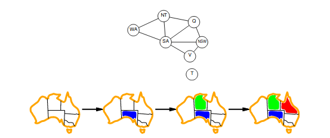

* Assume now this static order, WA, NT, Q, NSW, V, SA, T, and then these 2 assignments: WA = RED, NT = GREEN.
* Q would be default next selection. But is it a good choice... After WA and NT are assigned? Problem for SA?
## Minimum remaining values (MRV) heuristic
Which variable should be assigned next?


* __Minimum remaining values (MRV) heuristic:__ choose the variable with the fewest legal values
* Also called "most constrained variable" or "fail first" heuristic
* Objective: detect immediately if variable has no legal values (left) or most likely to cause a failure soon


## Degree heuristic
Which variable should be assigned next?
* Does MRV help in the very beginning?
* __Degree heuristic:__ choose the variable with the most constraints on remaining variables.
* Objective: reduce the future branching on future choices
* Tie-breaker among MRV variables


## What order should its values be tried?
* Heuristic for decision on value ordering.
* Given a variable, choose the __least constraining value:__ the one that rules out the fewest values in the remaining variables
* Objective: make more likely to find a solution early

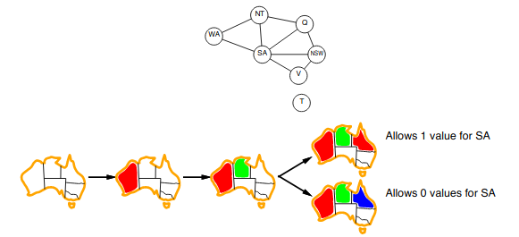

Combining these heuristics makes $1000$ queens feasible
## Inference in CSP
* A specific type of inference called __constraint propagation__ - node consistency, arc consistency, path consistency, $K$-consistency, forward cheking (restricted arc consistency)
* Objective: reduce legal values for a variable using constraints
* Reduction in legal values of a variable in turn reduces legal values of another variable...
## Improving Backtracking search through Inference
* It is possible to discover the unpromising nodes by inference for consistency
* Arc-consistency can be used during search, however time consuming
* Another possible type of inference is __Forward Checking__ of consistency
* Backtracking search can be pruned by applying Forward checking
* Forward checking:
  * is simpler than Arc consistency, checks only the direct neighbours
  * keep track of remaining legal values for unassigned variables
  * checks "future" rather than "past" which is what backtracking does.
## Backtracking with Forward Checking
* During search, assume assignment of a value to the next variable and check if it reduces the domain of its neighbours.

__Idea:__ Keep track of remaining legal values for unassigned variables
__Idea:__ Terminate search when any variable has no legal values
## Example: Backtracking with Forward Checking
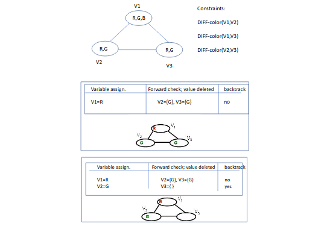
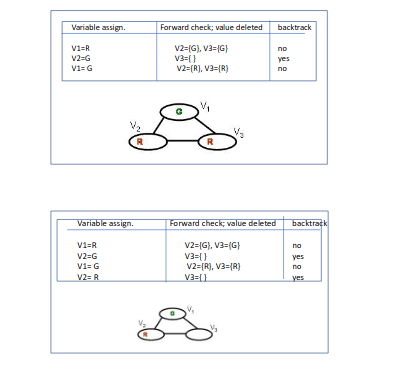
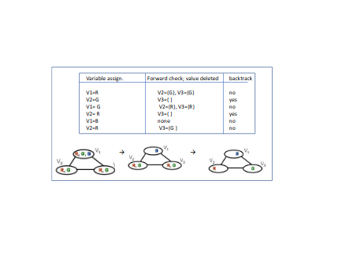
## Forward checking example in the book
__Idea:__ Keep track of remaining legal values for unassigned variables
__Idea:__ Terminate search when any variable has no legal values
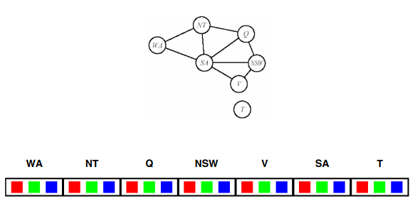
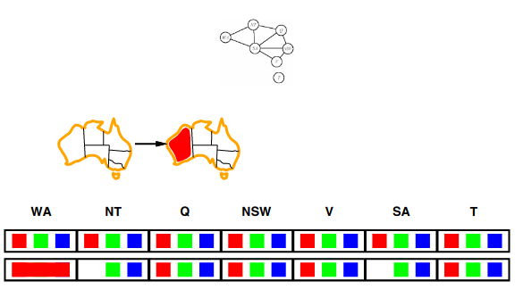
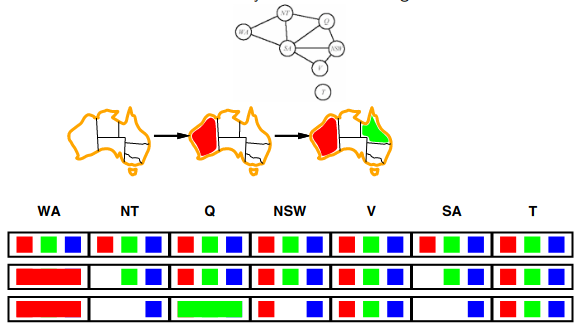
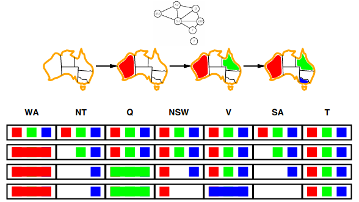
## Inference - Arc consistency
__Arck consistency__ eliminates the values from the domains of variables that can not be part of a solution

An arc $V_i\rightarrow V_j$ is consistent if

$\forall x\in D_i\exists y\,D_j$ such that $(x,y)$ is allowed by the constraint on the arc.

We can obtain arc consistency by removing values from the domains of the variables that fail the constraint.
## Arc consistency algorithm
```
function AC-3(csp) returns false if an inconsistency is found and true otherwise
    inputs: csp, a binary CSP with variables {X_1, X_2, ..., X_n}
    local variables: queue, a queue of arcs, initially all the arcs in csp

    while queue is not empty do
        (X_i, X_j) <-- REMOVE-FIRST(queue)
        if REMOVE-INCONSISTENT-VALUES(X_i, X_j) then
            for each X_k in NEIGHBOURS[X_i] do
                add (X_k, X_i) to queue
    return true
```
```
function REMOVE-INCONSISTENT-VALUES(X_i, X_j) returns true iff succeeds
    removed <-- false
    for each x in DOMAIN[X_i] do
        if no value y in DOMAIN[X_j] allows (x, y) to satisfy the constraint X_i <-> X_j
            then delete x from DOMAIN{X_i}; removed <-- true
    return removed
```
## Arc Consistency - Example
Three variables, V1, V2, V3, and their initial domains. Values within each node show the initial domains of the variables.

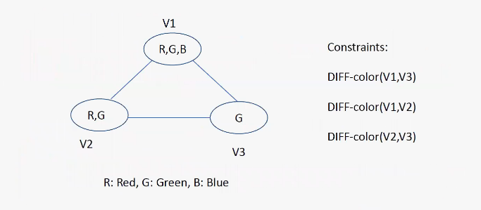
* A binary constraint (e.g., DIFF(V1, V2)) can be satisfied through checking 2 arcs, e.g. V1V2 and V2V1.
* ALl arcs are checked for consistency, e.g., according to algorithm AC-3

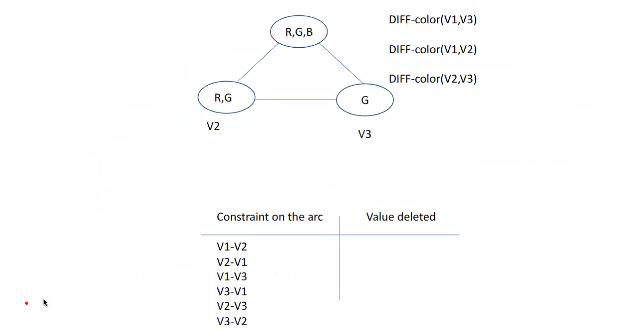
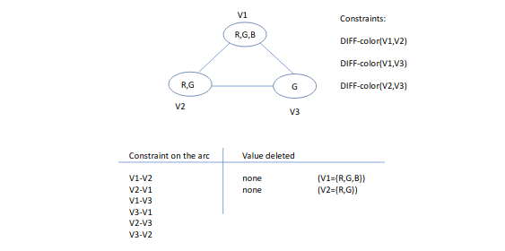
* For the arc V1-V2: check if there is a value in the domain of V2 for each value of V1 (i.e., R, G, B)
* For the arc V2-V1: check if there is a value in the domain of V1 for each value of V2 (i.e., R, G)

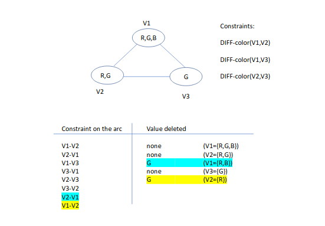
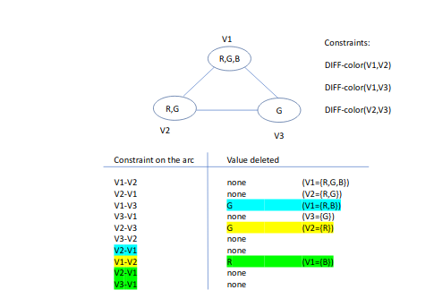

We stopped when there is no more changes.
## Arc Consistency
If one of the Domains become empty: there is no solution to the problem

ELSE: Arc consistency is required for existence of a solution - i.e., no empty domains

BUT: Is Arc consistency sufficient to find a solution?
## Arc Consistency - Example
Is this graph Arc-consistent?
Solution?

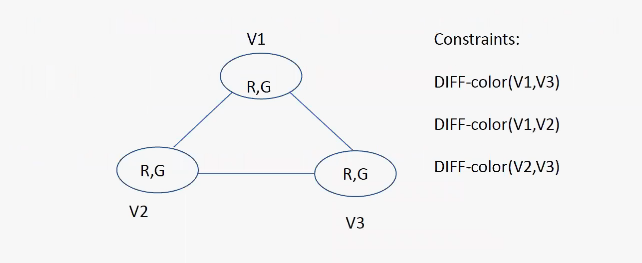

MESSAGE: SEARCH may be necessary to find a solution

PS! However, sometimes Arc-consistency alone may find the solution.
## Arc Consistency for Map Coloring
Forward checking propagates information from assigned to unassigned variables, but doesn't provide early detection for all failures:

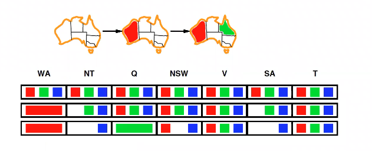

$NT$ and $SA$ cannot both be blue!

Arc consistency repeatedly enforces constraints locally


Simplest form of propagation makes each arc consistent

$X\rightarrow Y$ is consistent iff
for each value $x$ of $X$ there is some allowed $y$

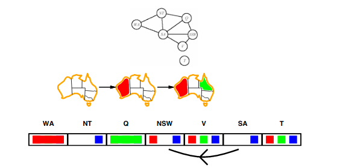
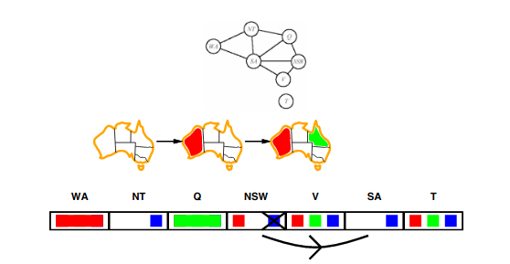
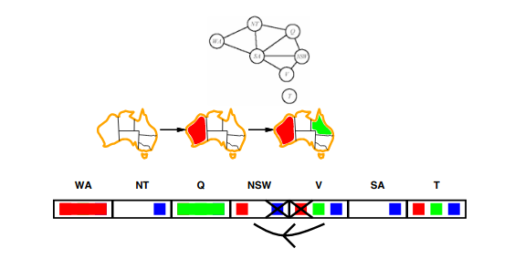
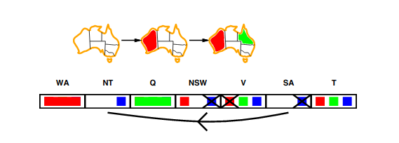

If $X$ loses a value, neighbors of $X$ need to be rechecked
Arc consistency detects failure earlier than forward checking
Can be run as a preprocessor or after each assignment
## Local search applied to CSP
* Iterative
* Generate complete assignments: assume/guess a value for each variable.
* Evaluate the assignments w.r.t. violated contraints.
* Modify the assignments to reduce the numbers of violations.
## Local search with heuristic
To apply CSPs:
* allow states with unsatisfied constraints
* operators __reassign__ variable values

Variable selection: randomly select any conflicted variable

Value selection: by __min-conflicts__ heuristic:
choose value that violates the fewest constraints
i.e., hillclimb with $h(n)=$ total number of violated constraints

The local search strategies (e.g., hill-climbinb, simulated annealing) in Lecture 4 are candidates for use in CSP.
## Solving K-Queens with _Dumb_ Local Search
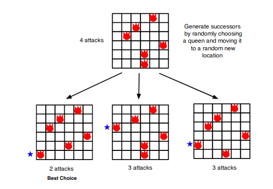
## Min Conflicts: Local Search with Intelligence
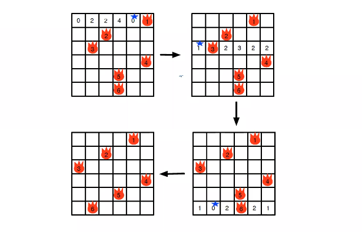
* Moving queen to column of least violations $\rightarrow$ intelligent successor generation.
* Integers denote number of violations if queen moved there.
## Problem structure


Tasmania and mainland are __independent subproblems__

Identifiable as __connected components__ of constraint graph
## Graph structure and problem complexity

* Solving disconnected subproblems
  * Suppose each subproblem has $c$ variables out of a total of $n.$
  * Worst case solution cost is $O(n/c\,d^c),$ i.e. linear in $n$
    * Instead of $O(d^n),$ exponential in $n$
* E.g. $n=80, c=20, d=2$
  * $2^{80}=4$ billion years at $1$ million nodes/sec.
  * $4*2^{20}=.4$ second at $1$ million nodes/sec.

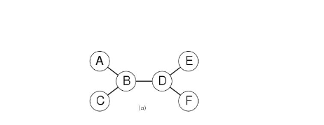

* Theorem:
  * if a constraint graph has no loops then the CSP can be solved in $O(nd^2)$ time
  * linear in the number of variables
* Compare difference with general CSP, where worst case is $O(d^n)$
