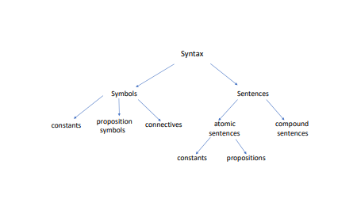
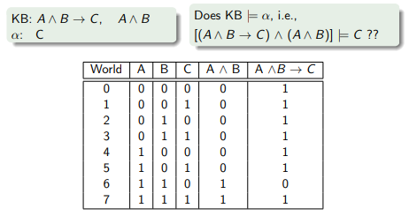

# Lecture 7: Logical Agents
## Knowkedge-based agents
* __Knowledge base (KB):__ A set of sentences that describe facts about the world in some formal (representational) language
* __Inference engine:__ A set of procedures that use the representational language to infer new facts from known ones as well as to answer a variety of KB queries.


## Operation on the Knowledge base
Two important operations on the KB:
* add new knowledge to KB
* ask questions about the knowledge in KB. Questions are "asked"/triggerred in two ways:
  * a direct question from the user that doesn't require reasoning but just __retrieval__ from the KB
  * a question representing a lack of knowledge required to solve a problem. This knowledge is implicit in the KB and need to be __inferred.__
## Inference and Retrieval
* What does it happen in your mind when you are asked this question?
  * Question: Is Stockholm in Sweden?
* What does it happen in your mind when you are asked this question?
  * Question: Does a vegan person eat snail?
* Different?
## A simple knowledge based agent
* Knowledge base = set of __sentences__ in a __formal__ language
* Declarative approach to building an agent (or other system):
  * __Tell__ it what it needs to know
  * Then it can __Ask__ itself what to do - answers should follow from KB

```
function KB-AGENT(percept) returns an action
    static: KB, a knowledge base
             t, a counter, initially 0, indicating time
    
    TELL(KB, MAKE-PERCEPT-SENTENCE(percept,t))
    action <-- ASK(KB, MAKE-ACTION-QUERY(t))
    TELL(KB, MAKE-ACTION-SENTENCE(action, t))
    t <-- t + 1
    return action
```
## Remember the Wumpus' Cave

## Wumpus World PEAS description


## First movement

* Knowledge Base: Rules of game/environment
* Location (always starts at): $[1,1]$
* Percept: $[\neg Stench, \neg Breeze, \neg Glitter, \neg Bump, \neg Scream]$
* Action: Move forward to cell $[2,1].$ Outcome: Location $[2,1]$
* New Percept: $[\neg Stench, Breeze, \neg Glitter, \neg Bump, \neg Scream]$
* Infer: There must be a pit in $[2,2]$ or $[3,1]$
* Action: Return to $[1,1]$ to try next safe cell.
## Next move

* Location: after move action - from $[1,1]$
* Percept: $[Stench, \neg Breeze, \neg Glitter, \neg Bump, \neg Scream]$
* Infer: Can there be a Wumpus in $[2,2]$ Why/not?
  * Remember - what is already in the KB?
* Action: Move to $[2,2]$
* Percept: 
* In the knowledge base: Pit in $[2,2]$ or $[3,1]$
* Pit in $[3,1]!$
## How to tell a machine to play the Wumpus game?
* How to reprsent the knowledge into the agent?
* How does the agent do the inference based on built knowledge?
* __We need a knowledge reprsentation language.__
* The objective of knowledge representation is to express the knowledge about the world in a computer-tractable form
* Various Knowledge Representation Languages
## Physical World and Internal Representations

## Computers and logic
* Computers can use logic in order to, e.g.m prove mathematical theorems and to diagnose failures
* But, first what is logic and how it works.


## Propositional Logic
In this lecture we deal with __Propositional (Boolean) Logic.__
## What is Logic
* One of the oldest disciplines in history
* Dates back to Aristoteles
  


## Please use logic all the time
* People use logic in order to talk about observations, to define concepts, and to formalize theories.
* People use logic to prove something.


* Using logical reasoning we can derive new information from what we already knew.


* We use logical proos to convince others of our conclusions..


## Syntax of Propositional Logic
Syntax - symbols, sentences
* Symbols (alphabet) consists of:
  * Constants: True, False
  * Propositon symbols: P, Q, ...
  * Connectives: $\wedge,\vee,\neg,\rightarrow,\Leftrightarrow$
* Sentences can be atomic (constants and propositions) or compound sentences
## Syntax

## Atomic Sentences
* __Proposition:__ a declarative statement about the world that is either true or false
* Which of the followings are propositions:
  * Norway is in Europe.
  * Stockholm is capital city of Norway.
  * What is your name?
  * Do your homework.
  * This sentence if false.
## Which of the following are propositions?
* Norway is in Europe (true).
* Stockholm is capital city of Norway (false).
* What is your name? (not declarative)
* Do your homework (not declarative). 
* This sentence if false (neither true nor false).
## Compound Sentences
* Compound sentences: constructed from atomic and/or other compound sentences via connnectives:
  * If $S$ is a sentence, $\neg S$ is a sentence (negation)
  * If $S_1$ and $S_2$ are sentences, $S_1\wedge S_2$ is a sentence (conjunction)
  * If $S_1$ and $S_2$ are sentences, $S_1\vee S_2$ is a sentence (disjunction)
  * If $S_1$ and $S_2$ are sentences, $S_1\implies S_2$ is a sentence (implication)
  * If $S_1$ and $S_2$ are sentences, $S_1\Leftrightarrow S_2$ is a sentence (biconditional)
## Example - Compound Sentences
Assume the following propositions:
* $P:$ It is sunny this afternoon.
* $Q:$ It is colder than yesterday.
* $Lg:$ The traffic light is green.
* $Cg:$ The cars will go.

How are the following compound sentences be represented in terms of the proposition symbols above?
1. It is not sunny this afternoon and it is colder than yesterday.
2. If the traffic light is green then the cars will go.
3. The cars will go only if traffic light is green.

Representations of these sentences in propositional logic:
1. $\neg P\wedge Q$
2. $Lg\implies Cg$
3. $Cg\implies Lg$
## Semantics in Propositional Logic
Semantics of __atomic__ sentences are determined according to their truth values wrt interpretations.

An __interpretation__ maps symbols to one of the two values: True $(T)$, or False $(F)$, depending on whether the symbol is __satisfied__ in the "world":
* $P:$ Light in the room is on _(True in Interpretation $I$)_ then Value$(P,I)=$ True.
* $Q:$ It rains outside (False) then Value$(Q,I)=$ False.
* If $P:$ Light in the room is on (False in $I'$) then Value$(P,I')=$ False.
## Semantics of Connectives
Semantics of __compositional__ sentences are determined using the standard rules of logic for connectives:


## Inference in propositional logic
How to desgin the procedure that answers $KB\models\alpha?$

__Inference methods in propositional logic:__
* Model checking/enumeration
* Inference algorithms
  * Resolution and Proof by Contradiction
  * Forward and Backward chaining
## Semantics of Inferring new information
* The logical agent can use the sentences in the Knowledge Base to draw conclusions that are __logically entailed__ by those sentences. Entailment is obtained in different ways in different inference methods.
## Entailment: A key semnatic relationship
* Entailment means that the truth of one sentence $(\alpha)$ follows from the truth of another (e.g., set of all sentences in $KB$)
* $KB\models\alpha$ ($KB$ entails $\alpha$) if and only if $M(KB)\subseteq M(\alpha)$
* Example:
  * $KB=$ "RBK won" and "Brann won"
  * $\alpha=$ "RBK won"

__Entailment is a relationship between sentences based on semantics__
## Model and Model checking
__Model:__ We say $m$ is a model of a sentence $\alpha$ if $\alpha$ is true in $m$

$KB=$ "RBK won" and "Brann won"
$\alpha=$ "RBK won"


$M(\alpha)$ is the set of all models of $\alpha$
## Example: Wumpus gridworld
Propositional representation of Wumpus gridworld.
* Rules of Wumpus game and representation of a game.
* Let $P_{i,j}$ be true if there is a pit in $[i,j].$
* Let $B_{i,j}$ be true if there is a breeze in $[i,j].$
* "Pits cause breezes in adjacent squares" = "A square is breezy __if and only if__ there is an adjacent pit"
* KB = wumpus-world rules + observations
## Wumpus world after the first 2 moves
* Situations after detecting nothing in $[1,1]$ and moving right, breeze in $[2,1]:$
  * $R_1:\neg P_{1,1}$
  * $R_2:B_{1,1}\leftrightarrow(P_{1,2}\vee P_{2,1})$
  * $R_3:B_{2,1}\leftrightarrow(P_{1,1}\vee P_{2,2}\vee P_{3,1})$
  * $R_4:\neg B_{1,1}$
  * $R_5:\neg B_{2,1}$
* $KB=R_1\wedge R_2\wedge R_3\wedge R_4\wedge R_5$
## Models in reduced Wumpus gridworld
Consider possbiel models for $KB$ assuming only pits and a __reduced__ Wumpus world with only 5 squares and pits:


## Wumpus Models
The reduced Wumpus World. All 8 possible worlds/models are:


## Decision in Wumpus world by Model Checking
Still reduced Wumpus gridworld example.


## Model Checking through Truth Tables
Truth Table is a simple method for model enumeration and checking.



* $M[(A\wedge B\rightarrow C)\wedge(A\wedge B)]=\{7\}\subseteq\{1,3,5,7\}=M(C).$
* Yes
## Example: Model enumeration in Wumpus world
* After visiting $(1,1)$ and $(2,1)$
  * $R_1:\neg P_{1,1}$
  * $R_2:B_{1,1}\leftrightarrow(P_{1,2}\vee P_{2,1})$
  * $R_3:B_{2,1}\leftrightarrow(P_{1,1}\vee P_{2,2}\vee P_{3,1})$
  * $R_4:\neg B_{1,1}$
  * $R_5:B_{2,1}$
* $KB=R_1\wedge R_2\wedge R_3\wedge R_4\wedge R_5$
* In this Wumpus world: 7 symbols (in $KB$). We can get $2^7=128$ models.
  

* Answer: $KB\models\neg P_{1,2}$. No pit in $P_{1,2}.$
## Inference by Model Enumeration
* Enumeration is sound and complete
* The truth table is exponential in the number of propositional symbols (we checked all rows/assignments)
* Model checking complexity:
  * If $KB$ and $\alpha$ contain $n$ symbols:
    * Time complexity: $O(2^n)$
    * Space complexity: $O(n)$
* __We need effective/smarter ways of doing inference__
## Inference Rules approach
* How to make the process more efficient?
* $KB$ is true on only a smaller subset
* __Solution:__ check only entries for which $KB$ is True.
* That is, infer new logical sentences from the knowledge base and see if they match a query
* This is the idea behind the inference rules approach
* _Inference rules_ represent sound inference patterns repeated in inferences.
## Properties of an Inference Procedure and connection to Entailment
* Assume an __inference procedure__ $i$ that
  * derives a sentence $\alpha$ from the $KB$, i.e. $KB\vdash_i\alpha$
* __Soundness:__ An inference procedure is sound
  * If whenever $KB\vdash_i\alpha,$ then it is also true that $KB\models\alpha$


* __Completeness:__ An inference procedure is complete
  * If whener $KB\models\alpha$ then it is also true that $KB\vdash_i\alpha$
* Sound and complete inference procedures are desirable
## Inference rules

## Some other inference rules

## Inference rules approach
* Inference rule approach: Apply an inference rule that matches with the knowledge in $KB.$ Do this until satisfying the query, e.g., $P_1.$
* Starting with a $KB$
  * ASK$(P_1):$ is $P_1$ true given what is in $KB?$
* Derive $P_1$ from the $KB$
1. Use inference rules to add new statements
2. Use __logical equivalence__ (next slide) to rewrite existing statements
## Logical equivalence
Two sentences are __logically equivalent__ iff true in same models:
$\alpha\equiv\beta$ if and only if $\alpha\models\beta$ and $\beta\models\alpha$


## Inference rules approach - Example
__KB:__ $P\implies Q,Q\implies R$
__Question:__ Does $KB\models(P\implies R)?$

Using Inference rules:
1. $P\implies Q$ (Premise)
2. $Q\implies R$ (Premise)
3. $P\implies (Q\implies R)$ (Implication Creation: 2)
4. $(P\implies Q)\implies(P\implies R)$ (Implication Distribution: 3)
5. $P\implies R$ (Modus Ponens: 4, 1)
## Problems with Inference rules approach
* There may be more than one rule that can apply at a certain stage.


* One solution: __Resolution__ is a single inference rule that yields a complete inference algorithm
## Some definitions
* A sentence is __satisfiable__ if it is true in __some__ models
* A sentence is __unsatisfiable__ if it is true in __no__ models
  * e.g., $A\wedge\neg A$
* A sentence is __valid__ if it is true in __all__ models,
  * e.g., $True,A\vee\neg A,A\implies A,(A\wedge(A\implies B))\implies B$
## Connection to Inference
* __Validity__ is connected to inference via the deduction theorem:
  * $KB\models\alpha$ if and only if $(KB\implies\alpha)$ is valid.
* Hence, $KB\models\alpha$ is true iff every interpretation that makes all $S\subseteq KB$ true, makes $\alpha$ true.
* __Satisfiability__ is connected to inference via the following:
  * $KB\models\alpha$ if and only if $(KB\wedge\neg\alpha)$ is unsatisfiable
  * i.e., __prove__ $\alpha$ by contradiction
## Proof by contradiction
* The inference rule called _Resolution Rule_ can be used for __proof by contradiction__
* Instead of showing $KB\models\alpha,$ we show that $KB\wedge\neg\alpha$ is not satisfiable.
* Disproving $KB,\neg\alpha$ proves the entailment $KB\models\alpha$
## Resolution Rule

## Resolution algorithm
Proof by contradiction, show $KB\wedge\neg\alpha$ unsatisfiable
```
function PL-RESOLUTION(KB, alpha) returns true or false
    inputs: KB, the knowledge base, a sentence in propositional logic
            alpha, the query, a sentence in propositional logic
    
    clauses <-- the set of clauses in the CNF representation of KB AND NOT alpha
    new <-- {}
    loop do
        for each C_i, C_j in clauses do
            resolvents <-- PL-RESOLVE(C_i, C_j)
            if resolvents contains the empty clause then return true
            new <-- new UNION resolvents
        if new subseteq clauses then return false
        clauses <-- claues UNION new
```
## Conjunctive Normal Form
However to apply resolution technique its required to represent $KB$ as well as any sentence $\alpha$ that we wish to derive in a special format known as __Conjunctive Normal Form__ (CNF): conjunction of disjunctive clauses of literals

* Example: $(A\vee B)\wedge(\neg A\vee\neg C\vee D)$
* a __disjunctive clause__ is a disjunction of literals.
* A clause is an expression of the form $I_1\vee I_2\dots I_k$ where each $I_i$ is a literal.
* a __literal__ is either a propositional symbol or the negation of a symbol.
* A sentence can be converted to CNF for by using Logical Equivalences.
## Resolution (Refutation) for Wumpus problem


Our knowledge base:
$$(B_{1,1}\leftrightarrow(P_{1,2}\vee P_{2,1}))\wedge\neg B_{1,1}$$

Now, we want to verify that there is no pit in $[1,2].\,\alpha=\neg P_{1,2}$

$$KB\models\alpha?$$
For this, we need to show that $KB\wedge\neg\alpha$ is unsatisfiable.
## Remember the Logical Equivalences

## Resolution Refutation on Wumpus Example
$$\begin{aligned}
KB&=(B_{1,1}\Leftrightarrow(P_{1,1}\vee P_{2,1}))\wedge\neg B_{1,1}\\
\alpha&=\neg P_{1,2}
\end{aligned}$$
Applying the Logical Equivalences to $KB\wedge\neg\alpha$, we convert the $KB$ into CNF:
$$(\neg P_{2,1}\vee B_{1,1})\wedge(\neg B_{1,1}\vee P_{1,2}\vee P_{2,1})\wedge(\neg P_{1,2}\vee\neg B_{1,1})\wedge(\neg B_{1,1})\wedge(P_{1,2})$$
## Conversion to CNF
$$B_{1,1}\Leftrightarrow(P_{1,2}\vee P_{2,1})$$
1. Eliminate $\Leftrightarrow,$ replacing $\omega\Leftrightarrow\beta$ with $(\omega\implies\beta)\wedge(\beta\implies\omega).$
$$(B_{1,1}\implies(P_{1,2}\vee P_{2,1}))\wedge((P_{1,2}\vee P_{2,1})\implies B_{1,1})$$
2. Eliminate $\implies,$ replacing $\omega\implies\beta$ with $\neg\omega\vee\beta.$
$$(\neg B_{1,1}\vee P_{1,2}\vee P_{2,1})\wedge(\neg(P_{1,2}\vee P_{2,1})\vee B_{1,1})$$
3. Move $\neg$ inwards using de Morgan's rules and double-negation:
$$(\neg B_{1,1}\vee P_{1,2}\vee P_{2,1})\wedge((\neg P_{1,2}\wedge\neg P_{2,1})\vee B_{1,1})$$
4. Apply distributivity law ($\vee$ over $\wedge$) and flatten:
$$(\neg B_{1,1}\vee P_{1,2}\vee P_{2,1})\wedge(\neg P_{1,2}\vee B_{1,1})\wedge(\neg P_{2,1}\vee B_{1,1})$$
## RR process on Wumpus example
$$\begin{aligned}
KB&=(B_{1,1}\Leftrightarrow(P_{1,1}\vee P_{2,1}))\wedge\neg B_{1,1}\\
\alpha&=\neg P_{1,2}
\end{aligned}$$


## Problem with Resolution Refutation
* Resolution is complete but can be exponential in space and time.
* If we can reduce all clauses to a special form called __Horn Clauses__, deciding entailment becomes linear in the size of the knowledge base (KB)
* Inference with Horn clauses can be done through the __forward chaining__ and __backward chaining__ algorithms
## Horn Clauses
* Definite clause: Disjunction of literals of which exactly one is positive; the rest are negative
* Horn Clause: Disjunction of literals of which at most one is positive


## Forward and backward chaining
* __Modus ponens__ is perfect for __Definite Clause__ KBs
* Two inference procedures:
  * __Forward chaining__ (data driven)
    * Idea: Whenever the premises of a rule are satisfied, infer the conclusion. Continue with rules that became satisfied.
  * __Backward chaining__ (goal driven)
    * Idea: To prove the fact that appears in the conclusion of a rule prove the premises of the rule. Continue recursively.
  * Both procedures are complete for KBs in the Definite clause form.

Forward and Backward algorithms rely on the inference rule __Modus Ponens__ (for definite clause Form):


## Forward chaining
Idea: fire any rule whose premises are satisfied in the $KB,$ add its conclusion to the $KB,$ until query is found


## Forward chaining example


## Backward chaning
Idea: work backwards from the query $q:$
to prove $q$ by BC,
check if $q$ is known already, or
prove by BC all premises of some rule concluding $q$

Avoid loops: check if new subgoal on the goal stack

Avoid repeated work: check if new suboal
1. has already been proved true, or
2. has already failed
## Backward chaining example


## Forward vs. backward chaining
FC is __data-driven__, cf. automatic, unconscious processing, e.g., object recognition, routine decisions

May do lots of work that is irrelevant to the goal

BC is __goal-driven__, appropiate for problem solving, e.g., Where are my keys? How do I get into a PhD program?

Complexity of BC can be __much less__ than linear in size of KB.