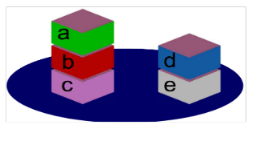
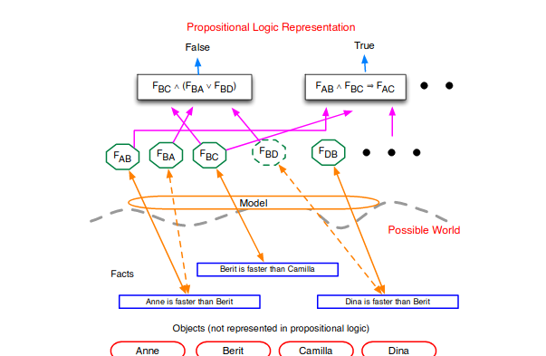
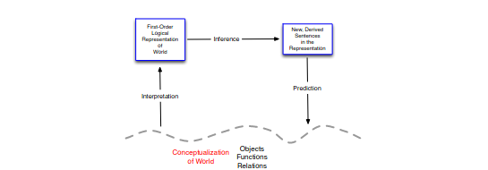
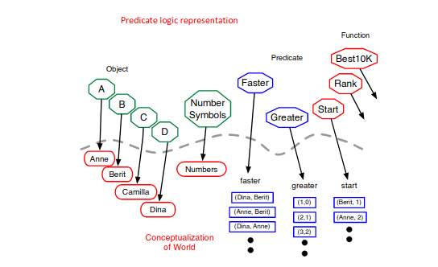
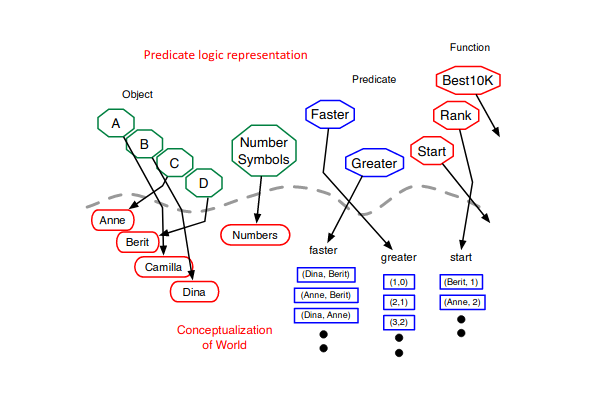
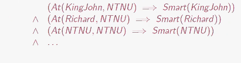
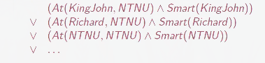
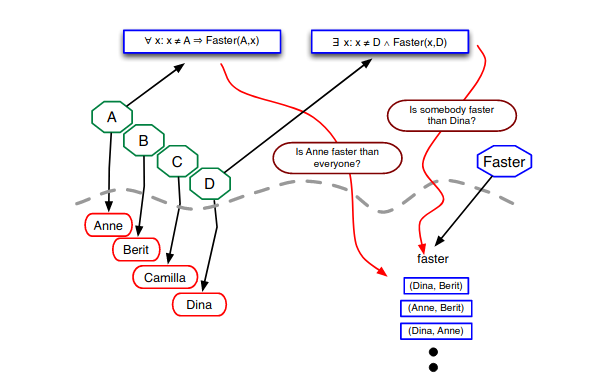
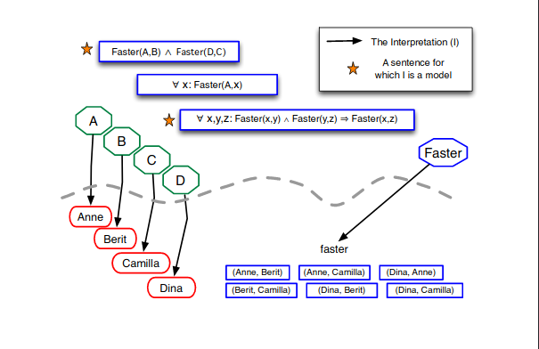
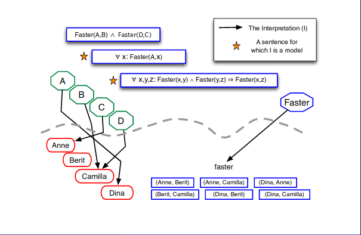

sh# Lecture 8: First Order Logic
## Pros and Cons of propositional logic
__PROS:__
* Propositional logic is declarative: pieces of syntax correspond to facts
* Propositional logic allows partial information (unlike most data structures and databases)
* Propositional logic is compositional: meaning of $B_{1,1}\wedge P_{1,2}$ is derived from meaning of $B_{1,1}$ and of $P_{1,2}.$
* Meaning in propositional logic is context-independent (unlike natural language, where meaning depends on context)

__CONS:__
* Propositional logic has very limited expressive power (unlike natural language)
## Limitations of propositional logic
* Some knowledge is hard or impossible to encode in the propositional logic.
* Two cases that are specially hard to represent:
  * Statements about similar objects, relations
  * Statements referring to groups of objects.
## Limitations of propositional logic - Example 1
* __Statements referring to groups of objects required to be enumerated__
* Example: Assume we want to express _Every student likes vacation:_
  * John likes vacation $\wedge$
  * Mary likes vacation $\wedge$
  * Ann likes vacation $\wedge$
  * ...
* __Problem:__ KB grows large
* __Possible solution: ??__
* _All students like vacation._
## Limitations of propositional logic - Example 2
* Statements about similar objects and relations need to be enumerated
* Assume we have
  * Stig is older than Sissel
  * Sissel is older than Paul
  * Stig is older than Sissel $\wedge$ Sissel is older than Paul $\implies$ Stig is older than Paul
  * We can derive _Stig is older than Paul_
* Assume we add _Hanne is older than Sissel_ into the KB
* The current KB Now:
  * Stig is older than Sissel
  * Sissel is older than Paul
  * Stig is older than Sissel $\wedge$ Sissel is older than Paul $\implies$ Stig is older than Paul
  * Hanne is older than Sissel
* What else do we need to have in the KB in order to derive _Hanne is older than Paul?_
* We need:
  * Hanne is older than Sissel $\wedge$ Sissel is older than Paul $\implies$ Hanne is older than Paul
* __What is the problem?__
* __KB grows large__
* __Possible solution: ??__
* PersA is older than PersB $\wedge$ PersB is older than PersC $\implies$ PersA is older than PersC
## Limitations of Propsitional Logic - example 3: Wumpus
* Consider the statement "If there is breeze in a square, there must be pit in an adjacent square"
* In propositional logic we need 16 sentences (one for each square) to represent this statement (for $4\times4$ grid):
  * $B_{1,1}\implies P_{1,2}\vee P_{2,1}$
  * $B_{1,2}\implies P_{1,2}\vee P_{1,3}\vee P_{2,2}$
  * ...
  * ...
* __We want to be able to say this in one single sentence.__
## How to say it in one sentence
* Our statement above refers to $2$ types objects (pit and square). The square has the property to be breezy. The relationship between a square and pit is adjacency, i.e., neighbourhood.
* In FOL, this statement is represented by means of the following formula - instead of 16 sentences in propositional logic:

$$\forall square, adjacent(square,pit)\implies breezy(square)$$
## Saying and Inferring more
* People eat and drink in Solsiden
  * conclude: People drink in Solsiden
* Ingrid watched Game of Thrones
  * conclude: Somebody watched Game of Thrones
* Every bird can fly. Canary is a bird.
  * conclude: Canary can fly
## First Order Logic (FOL)
* More expressive than propositional logic. While PL assumes that the world contains facts, FOL assumes the world containts
  * Objects: trees, people, numbers, movies, Trump :orange:, maps, colours, hypotheses, Wumpus...
  * Relations: square, smelly, brother of, older than, ownsm, has colour, adjacent to...
  * Functions: brother-of, colour-of, adjacent-to, ...
* Representing objects, their properties, relations and statements about them.
## First-order Logic
Like, PL, FOL has:
* Syntax: symbols and rules for combining them - the grammar - What you can express
* Semtantics: How the sentences relate to the world - What it means
* Inference procedure: Rules for deriving new sentences from the ones in KB
  * Reasoning
## Syntax of FOL - elements
* Constants: NTNU, KingHarald, 5, ...
* Predicates: Brother, >, -, ...
* Functions: Sqrt, LeftLegOf
* Variables: x, y, a, b, ...
* Connectives: $\neg, \wedge, \vee, \rightarrow, \leftrightarrow$
* Quantifiers: $\forall, \exists$
* First order logic or "predicate calculus" introduces __variables__ and __quantifiers__ to refer to objects in the world, their relations, group of objects, and to express general rules.
## Atomic Sentences
* Atomic sentence: predicate(term$_1$,...,term$_n$)
* Term: constant, or variable or function(term$_1$,...,term$_m$)
## Complex sentences
* Composed of atomic sentences using connectives
$$\neg S_1, S_1\vee S_2, S_1\wedge S_2, S_1\implies S_2, S_1\Leftrightarrow S_2$$
* Examples:
  * Brother(JonSnow, AryaStark) $\implies$ Sister(AryaStark, JonSnow)
  * Childish(Trump) $\vee$ BestStudents(Students(NTNU), Norway)
## Functions versus Relations
* Functions are a way of referring to individuals indirectly, e.g., - brother-of(Janne) and Edvard would refer to the same object(individual) if Janne's brother is the person name Edvard.
* Relations hold among objects:
  * brother(Janne,Edvard) is true of Edvard is Janne's brother
## Predicates
* A relation is the set of tuples of objects
  * Brotherhood relationship (Richard, John), (John, Richard)
  * Unary, binary, $n$-ary relations
* set of blocks a, b, c, d, e. The "On" relation included:
  * On = $(a,b),(b,c),(d,e)$
  * the predicate On$(a,b)$ can be interpreted as $(a,b)\in$ On.

## Example of comparison of Propositional Logic and FOL
Primitives in Propositional Logic. Ski-race example.
__Objects__
* Anne (A), Berit (B), Camilla (C), Dina (D)
* There are not actually represented in propositional logic.
* Only True-or-False facts __about__ them are represented.
* Objects alone do not have a truth value, whereas all primitives in propositional logic do.

__Propositional Symbols__
* $F_{AB}$ (Anne is faster than Berit), $F_{BA}$ (Berit is faster than Anne), ..., $F_{AC}$
* These have truth values and are the primitive terms
* Their logical combinations into sentences (representing specific facts or general rules) also have truth values.
## Models in Propositional Logic

## FOL Semantics - Interpretation
* An interpretation $I$ is defined by mapping symbols (e.g. constants, predicates) to the domain of discourse $D$ or relations on $D$
* domain of discourse: the set of objects in the world we represent and refer to
* An interpretation $I$ maps:
  * Constant symbols to object in $D$
  * Predicate symbols to relations and properties(1-ary rels.) on $D$
  * Function symbols to functional relations on $D$

## Ski Race: Conceptualization
__Objects__
* Anne, Berit, Camilla, Dina
* These are now represented in the logic, even though they still have no truth value.

__Functions__
* best10(person) $\rightarrow$ time. Mapping from athelte to their best 10K time.
* rank(person) $\rightarrow$ integer. Mapping from athlete to their seeding in the competition.
* start(person) $\rightarrow$ integer. Mapping from athlete to start order in the race, where slowest start first.
* These have no truth value and map one primitive object (person) to another (number).
* greater(X,Y) $\rightarrow$ {True, False}. Is the number X greater than number Y?
* faster(X,Y) $\rightarrow$ {True, False}. Is athlete X faster than athlete Y?
* These always have a truth value.
* These are often viewed as explicit lists of tuples, one list for each TRUE relation. So in one possible world, faster is represented by:
$$\{(anne, berit), (anne, camilla), (dina, anne), (dina, camilla),(camilla, berit), (dina, berit)\}$$
## Interpretations in First-Order Logic
Interpretation - Mapping from constant, function and predicate symbols of the representation to the conceptualization

## Another Legal Interpretation

## Universal Quantifiers
* Quantification express properties of collections of objects.
* $\forall:$ "For all"
* $\forall\,(variable)\,(sentence)$ Let $P(x):x+1\geq x$
* We can state the following: $\forall x P(x)$
* English translation: "for all values of $x, P(x)$ is true"
* English translation: "for all values of $x, x+1\geq x$ is true"
* Everyone at NTNU is smart:
$$\forall x\, At(x, NTNU)\implies Smart(x)$$
* $\forall x\, P$ is true in a model $m$ iff $P$ is true with $x$ being __each__ possible object in the model
* __Equivalent to the _conjunction_ of _instantiations_ of $P$__

## Existential quantification
* $\exists:$ "There exist a/some"
* $\exists\,(variables)\,(sentence)$
* Someone at NTNU is smart
$$\exists x\, At(x, NTNU)\wedge Smart(x)$$
* $\exists x\, P$ is true if in a model $m$ iff $P$ is true with $x$ being __some__ possible object in the model.
* __Equivalent to the _disjunction_ of _instantiations_ of $P$__

## Evaluating Sentences with Quantified Variables

## Ski Models - Interpretation 1

## Ski Models - Interpretation 2

## Common mistakes with Quantifiers
* Typically, $\implies$ is the main connective with $\forall$
* Common mistake: using $\wedge$ as the main connective with $\forall:$
$$\forall x\, At(x,NTNU)\wedge Smart(x)$$
means "Everyone is at NTNU and everyone is smart"
## Another common mistake to avoid
* Typically, $\wedge$ is the main connective with $\exists$
* Common mistake: using $\implies$ as the main connective with $\exists:$
$$\exists x\, At(x,NTNU)\implies Smart(x)$$
is true if there is anyone who is not at NTNU!
## Connections between $\forall$ and $\exists$
* ALl statements made with one quantifier can be converted ibto equivalent statements with the other quantifier by using negation.
* Remember De Morgan's Rules
  * $P\wedge Q\equiv(\neg(\neg P\vee\neg Q))$
  * $P\vee Q\equiv(\neg(\neg P\wedge\neg Q))$
  * $\neg(P\wedge Q)\equiv\neg P\vee\neg Q$
  * $\neg(P\vee Q)\equiv\neg P\wedge\neg Q$
* Generalized De Morgan's Rule
  * $\forall x\, P(x)\equiv \neg\exists x(\neg P(x))$
  * $\exists x\, P(x)\equiv \neg\forall x(\neg P(x))$
  * $\neg\forall x\, P(x)\equiv \exists x(\neg P(x))$
  * $\neg\exists x\, P(x)\equiv \forall x(\neg P(x))$
## Connections between $\forall$ and $\exists$
* Conversion/negation of a quantifier means to represent the quantified statement in terms of the "other" quantifier.
* Negation rules/laws:
  * $\neg\exists\equiv\forall\neg$
  * $\neg\forall\equiv\exists\neg$
  * $\neg\forall\neg\equiv\exists$
  * $\neg\exists\neg\equiv\forall$
## Multiple Quantifiers
* more complex sentences can be formulated by multiple varialbes and by nesting quantifiers
* Variables must be introduced by quantifiers, and belong to the innermost quantifier that mentions them
* Example
  * $\forall x, y\, Parent(x,y)\implies Child(y,x)$
  * $\forall x\, Human(x)\forall y Loves(x,y)$
  * $\exists x\, Human(x)\forall y Loves(x,y)$
* "For all $x$, there exists a $y$ such that $P(x,y)$"
  * $\forall x\exists y\, P(x,y)$
  * Example: $\forall x\exists y(x+y=0)$
* "There exists an $x$ such ahat for all $y$ $P(x,y)$ is true"
  * $\exists x\forall y\, P(x,y)$
  * Example: $\exists x\forall y(x\cdot y=0)$
## Order of Quantifiers
* Reversing the order of the same type of quantifiers does not change the truth value of a sentence
$\forall x\forall y\,P(x,y)$ is the same as $\forall y\forall x\,P(x,y)$
* $\exists x\forall y$ and $\forall x\exists y$ are not equivalent!
  * $\forall x\exists y\, Loves(x,y)$
  * $\exists x\forall y\, Loves(x,y)$
## Example - Order of Quantifiers
* $\forall x\exists y\, Loves(x,y)$
  * Everyone in the world loves someone.
  * Everybody does not necessarily love the same person. $y$ may be different.
  * With parantheses: $\forall x(\exists y\, Loves(x,y))$
  * $y$ is inside the __scope__ of $x$
* $\exists x\forall y\, Loves(x,y)$
  * There is a person who loves everyone in the world
  * The same person $x$ loves everybody.
  * $y$ is inside the scope of $x$
* $\exists y\forall x\, Loves(x,y)$
  * There is someone whom everybody likes
  * Everybody likes the same $y$
  * $x$ is inside the scope of $y$
## Negating multiple Quantifiers
* Recall negation rules for single quantifiers:
  * $\neg\forall x\, P(x)\equiv\exists x\neg P(x)$
  * $\neg\exists x\, P(x)\equiv\forall x\neg P(x)$
* You change the quantifier(s), and negate what it's quantifying:
$$\neg(\forall x\exists y\, P(x,y))\equiv\exists x\neg\exists y\, P(x,y\equiv\exists x\forall y\neg P(x,y)$$
