# Lecture 9: Inference in First Order Logic
## Inference by Reduction to Propositionalized Sentences
* In First order logic we formlate the inference in the same way as PL.
* We want to find out whether a KB entails a sentence $\alpha$
* One inference approach is to propositionalize the sentences in KB and then apply inference methods (e.g., resolution refutation) used in propositiona logic
  * Every FOL KB can be propositionalized so as to preserve entailment
  * A sentence is entailed by new KB iff it is entailed by the original KB
## Propositionalization process
Every KB in FOL can be "propositionalized"
* instantiate universal quantification
* instantiate existential quantification
## Propositionalization
* Suppose the KB contains just the following:
$$
\forall x\,King(x)\wedge Greedy(x)\implies Evil(x)\\
King(John)\\
Greedy(John)\\
Brother(Richard, John)
$$
* To "propositionalize", we need to get rid of __quantifiers__ and __variables.__
## Propositionalization of Universal Quantification
* We instantiate the universal sentence in _all_ possible ways.
  * The "Substitution" rule for instantiation of variables (for propositionalization):

variable $x$ in the sentence $\alpha$ is substituted with a ground term $g$
* Variable $x$ is _substituted_ with the _ground terms_ referring to the objects _John_ and _Richard_ in the model one by one.
## Propositionalization of Existential Quantification
Removal of existential quantifiers.
* Each existentially quantified variable is replaced by a _Skolem_ constant or a _Skolem function._
* __Skolem Constant:__ if the existential variable is not within the scope of any universaly quantified variable. Every instance of the existentially quantified variable is replaced with the same unique constant, a brand new one does not appear anywhere else.
* For any sentence $\alpha$ with variable $x,$ $x$ is substituted by _new constant symbol_ $k$ __that does not appear elsewhere in the knowledge base:__

E.g., $\exists y(P(y)\wedge Q(y))$ is converted to: $P(CC)\wedge Q(CC)$
## Skolemization
* __Skolem Function:__ If the existential quantifier is in the __scope__ (i.e., "inside") of a (or more, e.g., $n$) universally quantified variables, then replace it with a unique $n$-ary function over these universally quantified variables. Remove then the existential quantifier.

E.g.,
$$\forall x\exists y(P(x)\vee Q(y))$$
converted to
$$\forall x\,P(x)\vee Q(f(x))$$
## Problems with propositionalization
* Problems: with function symbols, there are infinitely many ground terms,
  * e.g., Father(Father(Father(John))), etc.
## Solution: Herbrand Theorem
* Herbrand Theorem (1930). If a ground sentence $\alpha$ is entailed by an FOL KB, it is entailed by a finite subset of the propositionalized KB
  * Idea: For $n=0$ to $\infty$ do
    create a propositional KB by instantiating with depth-$n$ terms
    see if $\alpha$ is entailed by this $KB$
* Problem: works if $\alpha$ is entailed, loops if $\alpha$ is not entailed. Hence, it is semi-decidable.
* Theorem: Turing (1936), Church(1936) Entailment for FOL is semidecidable (algorithm exist that say yes to every entailed sentence, but no algorithm exists that also says no to every nonentailed sentence.)
## Problems with propositionalization
* Propositionalization seems to generate lots of irrelevant sentences.
Eg. from
$$
\forall x\,King(x)\wedge Greedy(x)\implies Evil(x)\\
King(John)\\
Greedy(John)\\
Brother(Richard, John)
$$
* It seems obvious that $Evil(John)$ will be inferred at the end, but propositionalization produces lots of facts such as $Greedy(Richard)$ that are irrelevant
* With $p$ $k$-ary predicates and $n$ constants, there are $p\cdot n^k$ instantiations
## Inference without propositionalization
* Problem: Universal elimination gives us (too) many oppurtunities for substituting variables with ground terms
* Solution: avoid making blind substitution of ground terms
  * Make substitutions that help to advance inferences
  * i.e., use substitutions matching "similar" sentences in KB
* Make, inferences on the variable level
  * How?

UNIFICATION: takes two sumilar sentences and computes the __substitution__ that makes them look the same, if it exists
UNIFY(P,Q)$=\theta;$ SUBST($\theta$,P)$=$SUBST($\theta$,Q)
## Motivating example for Unification
* Ground clases are clauses with no variables in them. For ground clauses we can use syntactic identity to detect when we have a $P$ and $\not P$ pair.
* What about variables? For example, can the following two clauses be resolved?
  * $P(john)\vee Q(fred)\vee R(x)$
  * $\neg P(y)\vee R(susan)\vee R(y)$

__KB:__ 
$(\forall x)(Bird(x)\implies Flies(x))\\Bird(Tweety)$
__Query:__ $Flies(Tweety)?$
* Convert to a clausal form:
$\neg Bird(x)\vee Flies(x)\\Bird(Tweety)$
* Can we apply _unit resolution rule_ here and infer $Flies(Tweety)?$
## Unification
* If two clauses have matching but complementary literals, we can resolve them.
* If we have a literal $P(x),$ where $x$ is a variable, in one clause and a complementary literal $\neg P(y)$ where $y$ is a term that does not contain $x,$ we can substitute $y$ for $x$ throughout the first clause.
* ... and then do propositional resolution on the complementary literals to produce the resolvent of the two clauses.
* Consider the two clauses:
  * $P(f(y),A)\vee Q(B,C)$
  * $\neg P(x, A)\vee R(x,C)\vee S(A,B)$
* Substituting $f(y)$ for the $x$ in the second clause yields
$Q(B,C)\vee R(f(y),C)\vee S(A,B)$
The appropiate substitution process i called _unification_
## Unification process
* Unify procedure: Unify(P, Q) takes two atomic (i.e. single predicates) sentences $P$ and $Q$ and returns a subsitution that makes $P$ and $Q$ identitcal.
* The aim is be able to mach literals even when they have variables.
* Rules for substitutions: Can replace a variable
  * by a constant.
  * by a varuable.
  * by a function expression, as long as the function expression does not contain the variable.

__Unifier:__ a substitution that makes two clauses resolvable, e.g., 
$$\theta:\{x_1/M; x_2/x_3; x_4/f(..)\}$$
* A substitution $\theta$ is a set of pairings of variables with terms (i.e., constant symbol, variable or function(term, ...))
$\theta=$ {v1/term1, v2/term2, ...}
* A unifier of two formulas $\alpha$ and $\beta$ is a substitution $s$ that makes $\alpha$ and $\beta$ syntactically identical.
* Two sentences $\alpha$ and $\beta$ are unified by $\theta$
$Unify(\alpha,\beta)=\theta$ if $\alpha\theta=\beta\theta$
* Not all formulas can be unified - substitutions only affect variables.
  * Example: Consider the pair $p(f(x),a)$ and $p(y(f(w)))$
  * This pair cannot be unified as there is no way of making $a=f(w)$ with a substitution.
  * in $\theta,$ each variable is paired at most once
  * A variable's pairing term may not contain the variable directly or indirectly
    * e.g., can't have substitution $\{x/f(y), y/f(x)\}$
  * When unifying expressions $P$ and $Q,$ the variable names in $P$ and the variable names in $Q$ should be disjoint.
    * Yes: $UNIFY(Loves(John, x), Loves(y, Jane))=\theta=\{x/Jane, y/John\}$
    * No: $UNIFY(Loves(John, x), Loves(y, Jane))=\theta=\{x/Jane, y/John\}$
## Unification
* Unification: Makes two sentences equivalent by substituting values for variables.
* Given the KB:
$
S_1: \forall x\,King(x)\wedge Greedy(x)\implies Evil(x)\\
S_2: King(John)\\
S_3: \forall y\, Greedy(y)\\$
We want to infer Evil(John)
* __Unify__ $S_1$ and $S_2$ by __substituting__ $x$ with John (shown as {x/John}), and $S_1$ and $S_3$ with {y/John}
* Two sentences $\alpha$ and $\beta$ are unified by $\theta$
$Unify(\alpha,\beta)=\theta$ if $\alpha\theta=\beta\theta$
## Unification - exercise
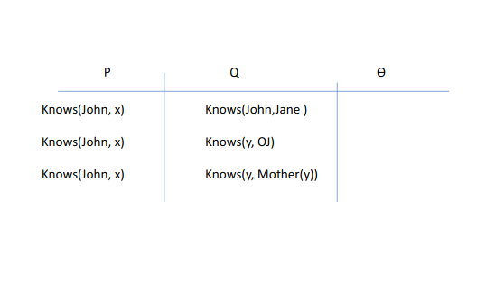
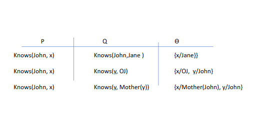
## Unify and Infer
A subtitution $\theta$ unifies atomic sentences $P$ and $Q$ if $subst(\theta, P)=subst(\theta, Q)$ (also denoted $P\theta=Q\theta$)

Idea: Unify rule premises with known facts, apply unifier to conclusion
E.g., if we know both $Q$ and $Knows(John, x)\rightarrow Likes(John, x)$ then we conclude

Likes(John, Jane)
Likes(John, OJ)
Likes(John, Mother(John))
## Most General Unifier
* Our aim is to be able to match conflicting literals (for the use of resolution), even when they have variables. Unification process determines whether there is a "specialization" that matches.
* However, we don't want to over specialize
## Most General Unifier - example
* Consider the two sentences:
  * $\neg P(x)\vee S(x)\vee Q(April)$
  * $P(y)\vee R(y)$
* Possible resolvants:
  * $(S(Arvid)\vee Q(April)\vee R(Arvid))$ $\{y=x, x=Arvid\}$
  * $(S(Sophie)\vee Q(April)\vee R(Sophie))$ $\{y=x, x=Sophie\}$
  * $(S(x)\vee Q(April)\vee R(x))$ $\{y=x\}$
* The last resolvant is "most-general", the other two are specializations of it.
* We want to keep the most general clause so that we can use it future resolution steps.
## Most general unifier
* Unification is not uniquq
* $Unify(Loves(John, y), Loves(x, y))=\theta=x/John, y/Jane$ or $\theta=x/John, y/z$
* Informally, the most general unifier (MGU) imposes the fewest constraints on the terms (contains the most variables).
* Formally, a substitution $\theta$ is more general than $\beta$ iff there is a substitution $\sigma$ such that $\theta\sigma=\beta.$
e.g. $\theta=z/F(w)$ is more general than $\beta=z/F(C)$ since $\sigma=w/C$
* A most general unifier $\theta$ of $P$ and $Q$ is such that, for any unifier $\rho$ of $P$ and $Q,$
there exists a substitution $P\theta=Q\theta=(P\theta)\rho.$
## Motivation for Standardizing apart
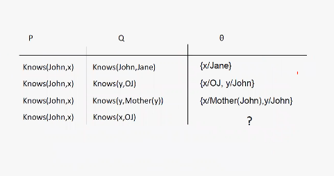
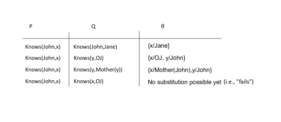
## Standardizing apart
$Knows(John, x)$ and $Knows(x, OJ)$ cannot be unified, i.e., unifications _fails._ Needs __"Standardizing apart".__
* Intuitively we know that if we knpw: John hates everyone he knows and that everyone knows OJ. So we should be able to infer that John hates OJ.
* This is why we require that every variable has a separate name.
* UNIFY $Knows(John, z_{27})$ and $Knows(z_{17}, OJ)$. This works!!!
* __Standardizing apart__ eliminates overlap of variables.
## Inference without propositionalization: Forward and backward chaining
Our previous example:
$S_1: \forall x\,King(x)\wedge Greedy(x)\implies Evil(x)\\
S_2: King(John)\\
S_3: \forall y\, Greedy(y)\\
S_4: Brother(Richard, John)$

Now we would like to infer $Evil(John)$ without propositionalization. __We can use Modus ponents, but its "generalized" form.__
## Adapting Modus Ponens to FOL
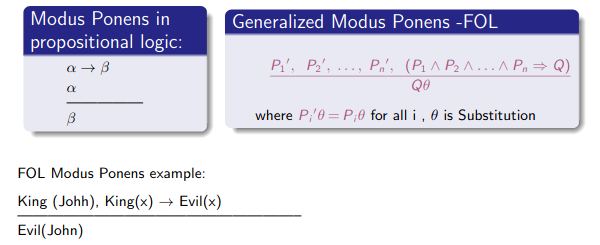
* $P_1'$ is $King(John)$ and $P_1$ is $King(x)$
* $\theta$ is $\{x/John\}$
* $Q\theta$ is $Evil(John)$
## Inference through Forward and Backward Chaning in FOL
Example KB:

The law says that it is a crime for an American to sell weapons to hostile nations. The country Nono, an enemy of America, has some missiles, and all of its missiles were sold to it by Colonel West, who is American.

We want to Prove that __"Colonel West is criminal".__

* We need
  * to translate these natural language sentences to FOL
  * convert these sentences in the KB to Definite Clauses if they are not in DC form by eliminating quantifiers:
    * remove $\forall$
    * eliminate $\exists$ by skolemization

__Knowledge Base__
$S_1:$ It is a crime for an American to sell weapons to hostile nations:
$$\forall x,y,z\,American(x)\wedge Weapon(y)\wedge Sells(x,y,z)\wedge Hostile(z)\implies Criminal(x)$$
$S_1: American(x)\wedge Weapon(y)\wedge Sells(x,y,z)\wedge Hostile(z)\implies Criminal(x)$

$S_2:$ Nono ... has some missiles
$$\exists x\, Owns(Nono, x)\wedge Missile(x)$$

$S_2: Owns(Nono, M_1)\wedge Missile(M_1)$

$S_3:$ ... all of its missiles were sold to it by Colonel West
$$\forall x\, Missile(x)\wedge Owns(Nono, x)\implies Sells(West, x, Nono)$$

$S_3: Missile(x)\wedge Owns(Nono, x)\implies Sells(West, x, Nono)$

$S_4:$ Missiles are weapons.
$$\forall x\,Missile(x)\implies Weapon(x)$$

$S_4: Missile(x)\implies Weapon(x)$

$S_5:$ An enemy of America counts as "hostile"
$$\forall x\, Enemy(x, America)\implies Hostile(x)$$

$S_5: Enemy(x, America)\implies Hostile(x)$

$S_6:$ West, who is American...

$S_6: American(West)$

$S_7:$ The country Nono, an enemy of America...

$S_7: Enemy(Nono, America)$
## Forward chaining algorithm - abstract
* Similar to Propositional Logic, restriction on sentences - definite clause.
* Find and use rules that have as premises the known facts in the KB.
  * In Propositional Logic: $A\wedge B\implies C$
  * In FOL: $King(x)\wedge Greedy(x)\implies Evil(x)$
  * FOL Needs Unification to match sentences
* Continue matching and deriving consequences of sentences until deriving the goal.
## Forward chaining proof of Colonel West
Our data base:
1. $American(x)\wedge Weapon(y)\wedge Sells(x,y,z)\wedge Hostile(z)\implies Criminal(x)$
2. $Owns(Nono, M_1)$
3. $Missile(M_1)$
4. $Missile(x)\wedge Owns(Nono, x)\implies Sells(West, x, Nono)$
5. $Missile(x)\implies Weapon(x)$
6. $Enemy(x, America)\implies Hostile(x)$
7. $American(West)$
8. $Enemy(Nono, America)$
## Forward chaining proof of Colonel West

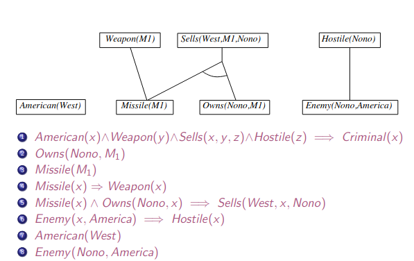
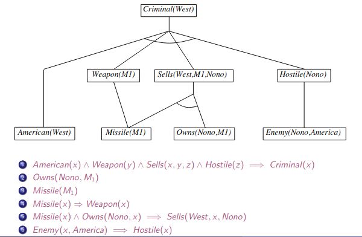
## Backward chaining example
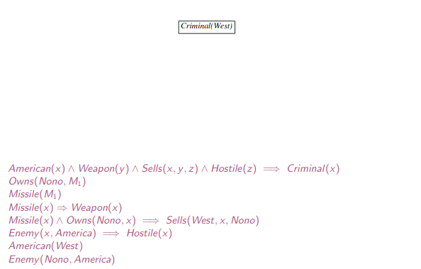
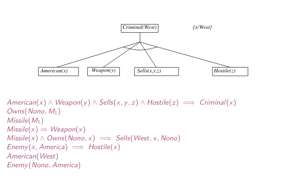
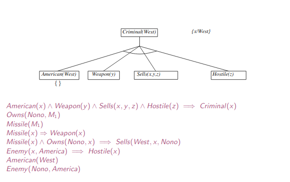
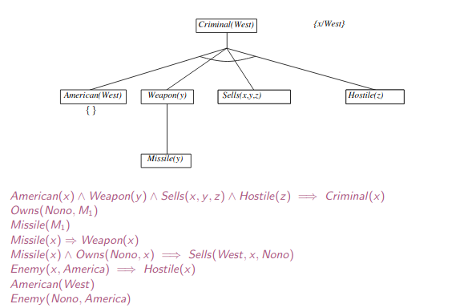
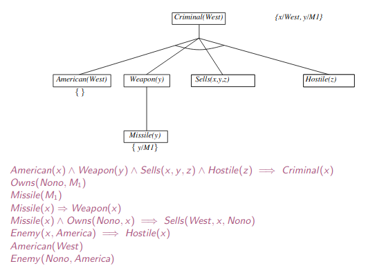
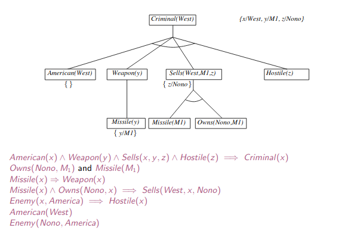
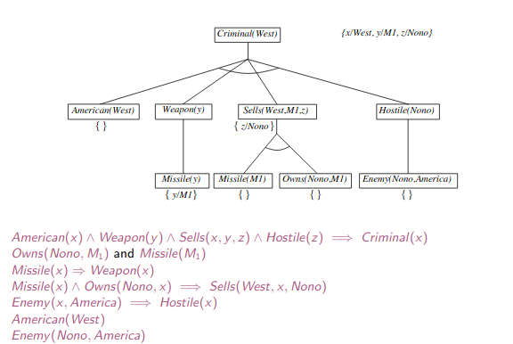
## Example Resolution Refutation - same example
Now we solve the same Colonel West example using resolution, more correctly resolution refutation.

First, we look at Resolution rule in FOL.
## Resolution Rule
Full first-order version:
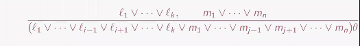
where $UNIFY(l_j, \neg m_j)=\theta.$

Two standardized clauses can be resoved if they contain __complementary literals__ (one is the negation of the other). FOL literals are complementary if one _unifies_ with the negation of the other.

Apply resolution steps to $CNF(KB\wedge\neg\alpha);$ complete for FOL.
## Conversion to CNF - example
We'll soon start solving Colonel West example using Resolution Refutation.
* The idea is the same as in Propositional Logic:
Our goal is to determine if $KB\models\alpha:$
1. Add $\neg\alpha$ to the $KB$
2. Convert $KB$ and $\alpha$ to Conjunctive Normal Form
3. Use the resolution rule and search to determine whether the ststem is satisfiable (SAT)

* Let us look at the procedure for conversion of FOL sentences to CNF through an example.

Translate this sentence to FOL and convert to CNF:

"Everyone who loves all animals is loved by someone"
$$\forall x[\forall y\, Animal(y)\implies Loves(x,y)]\implies [\exists y\, Loves(y,x)]$$

1. Eliminate biconditionals and implications
$$\forall x[\neg\forall y\, \neg Animal(y)\vee Loves(x,y)]\vee [\exists y\, Loves(y,x)]$$

2. Move $\neg$ invards: $\neg\forall x,p\equiv\exists x\,\neg p,\quad\neg\exists x,p\equiv\forall x\,\neg p:$
$$\forall x[\exists y\, \neg(\neg Animal(y)\vee Loves(x,y))]\vee [\exists y\, Loves(y,x)]\\
\forall x[\exists y\, \neg\neg Animal(y)\wedge\neg Loves(x,y)]\vee [\exists y\, Loves(y,x)]\\
\forall x[\exists y\, Animal(y)\wedge\neg Loves(x,y)]\vee [\exists y\, Loves(y,x)]
$$

3. Standardize variables: each quantifier should use a different variable name
$$\forall x[\exists y\, Animal(y)\wedge\neg Loves(x,y)]\vee [\exists z\, Loves(z,x)]$$

4. Skolemize: Each existential variable is replaced by a Skolem function of the enclosing universally quantified variables:
$$\forall x[Animal(f(x))\wedge\neg Loves(x,f(x))]\vee Loves(g(x),x)$$

5. Drop universal quantifiers:
$$[Animal(f(x))\wedge\neg Loves(x,f(x))]\vee Loves(g(x),x)$$

6. Distribute $\wedge$ over $\vee:$
$$[Animal(f(x))\vee Loves(g(x),x)]\wedge[\neg Loves(x, f(x))\vee Loves(g(x),x)]$$
## Colonel West using Resolution Refutation
* KB:
$American(x)\wedge Weapon(y)\wedge Sells(x,y,z)\wedge Hostile(z)\implies Criminal(x)$
$Owns(Nono, M_1)\wedge Missile(M_1)$
$Missile(x)\wedge Owns(Nono, x)\implies Sells(West, x, Nono)$
$Missile(x)\implies Weapon(x)$
$Enemy(x, America)\implies Hostile(x)$
$American(West)$
$Enemy(Nono, America)$
* Question: Is colonel West criminal?
## Colonel West example in CNF form
1. $\neg American(x)\vee\neg Weapon(y)\vee\neg Sells(x,y,z)\vee\neg Hostile(z)\vee Criminal(x)$
2. $\neg Missile(x)\vee\neg Owns(Nono, x)\vee Sells(West, x, Nono)$
3. $\neg Enemy(x, America)\vee Hostile(x)$
4. $\neg Missile(x)\vee Weapon(x)$

* Facts:
$American(West), Owns(Nono, M_1), Missile(M_1), Enemy(Nono, America)$
* Add $\neg Criminal(West)$

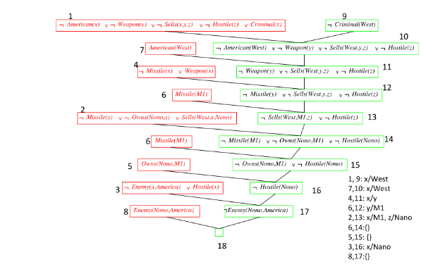